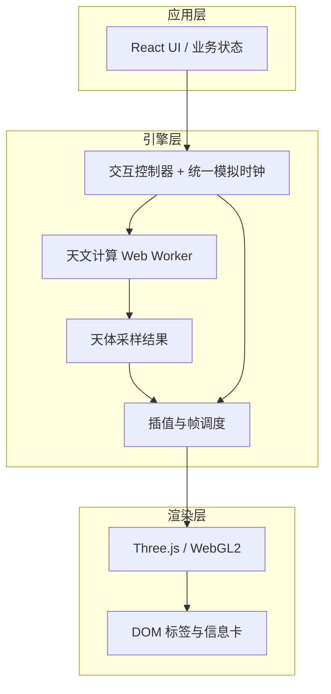

# Ad Astra

Ad Astra 是一款可交互、可离线使用的实时星空 Web 应用。它根据观测地点和时间，在浏览器中还原当时当地的星空，适合天文科普、认识星座以及直观观察星空随时间的变化。

**预览**：[https://adastra.zhangzhicheng.info/](https://adastra.zhangzhicheng.info/)

## 功能介绍

- **查看任意时空下的星空**：选择常用城市或手动输入经纬度，并设置日期和时间。
- **自由探索天空**：通过鼠标拖拽改变朝向和仰角，使用滚轮或触控板缩放，也可快速切换东、南、西、北和天顶视角。
- **推演时间变化**：支持播放、暂停、时间轴拖动以及不同时间跨度的前进和后退，观察星空东升西落和天体位置变化。
- **展示主要天体**：显示亮星、星座、太阳、月亮和肉眼可见的主要行星；点击恒星或天体可查看名称、亮度、方位角、高度角和月相等信息。
- **按需控制图层**：可切换银河、星座连线、地平线、黄道、天赤道、赤道网和地平网等辅助图层。
- **调整星空密度**：通过视星等上限控制画面中显示的恒星数量。
- **离线访问**：生产构建会生成 Service Worker，缓存应用与核心数据，首次加载完成后可离线打开。

## 技术方案

### 总体架构

项目采用纯前端静态 PWA 架构，不依赖运行时后端服务：



- **应用层**：React 负责页面布局、地点与时间设置、图层控制和对象详情。
- **交互层**：Pointer Events、滚轮和键盘输入由独立控制器处理，高频视角状态不经过 React 每帧重渲染。
- **天文计算层**：太阳、月亮和行星计算在 ES Module Web Worker 中执行；主线程在采样结果之间插值，避免计算阻塞交互。
- **渲染层**：Three.js 管理 WebGL2 场景，恒星、天体、星座和辅助线使用批量几何与自定义 GLSL Shader 绘制。
- **数据层**：恒星目录在构建期归一化、按视星等排序并打包为二进制文件；运行时校验长度和 SHA-256 后加载。
- **离线层**：Vite 构建插件生成 Service Worker，对带内容哈希的应用资源和星表进行版本化缓存。


### 数据来源

- **太阳、月亮和主要行星**：使用 MIT 许可的 [Astronomy Engine](https://github.com/cosinekitty/astronomy) 在浏览器 Worker 中实时计算。
- **恒星目录**：当前仓库默认使用项目自有的 `fixture-bright-stars` 开发夹具，约 226 颗亮星（含星座连线锚点），位于 `public/data/v1/`。
- **星座连线**：由项目维护的 YAML 数据生成，不直接复制授权不明确的第三方连线文件。
- **城市与时区**：当前内置上海、北京、伦敦、纽约和悉尼等少量预设，时区使用 IANA 标识并由浏览器 `Intl` API 处理。

当前默认数据适用于开发、测试和 `npm run build`，并非完整生产星表。画面星星少是因为打进去的是夹具，不是渲染上限。有授权也不等于自动拉取全天目录：生产构建门禁通过后，仍需把 BSC5P/SAO 等候选源接入构建期适配器，目标是大约 `+5.5` / `+8.0` 的科普星表，不是银河系全部恒星。详情见 [数据发布门禁](docs/data-release-gate.md)。

### 主要技术与工具

- React 19、TypeScript
- Three.js、WebGL2、自定义 GLSL Shader
- Astronomy Engine、Web Worker
- Vite 8、Lightning CSS
- Vitest、Oxlint、TypeScript 类型检查
- Service Worker、Cache Storage、Web App Manifest

更完整的设计说明见：

- [产品设计](docs/product-design.md)
- [技术文档](docs/technical.md)
- [天文知识](docs/astronomy.md)
- [数据发布门禁](docs/data-release-gate.md)


## 从零开始运行


### 环境要求

- Node.js 20.19+ 或 22.12+
- npm
- 支持 WebGL2 和 ES Module Worker 的现代浏览器

推荐使用 Chrome、Edge、Safari 或 Firefox 的近期版本。

### 1. 获取代码

```bash
git clone https://github.com/gunerguner/AdAstra.git
cd AdAstra
```

如果已经下载了源码，直接进入项目根目录即可。

### 2. 安装依赖

```bash
npm ci
```

没有 `package-lock.json` 时可改用：

```bash
npm install
```


### 3. 启动开发服务

```bash
npm run dev
```

终端会输出本地访问地址，默认通常为：

```text
http://localhost:5173/
```

开发模式下不会注册离线 Service Worker，以避免缓存影响热更新。

### 4. 运行检查

```bash
# 类型检查
npm run typecheck

# 代码检查
npm run lint

# 单元测试
npm test

# 类型、代码、测试和天文黄金样例的完整验证
npm run verify
```


### 5. 构建和本地预览

```bash
npm run build
npm run preview
```

普通 `build` 会先生成开发夹具星表，再把静态产物输出到 `dist/`。`dist/` 可以部署到支持 HTTPS 的静态文件服务器或 CDN；正式环境需要 HTTPS，Service Worker 才能正常工作。

## Docker 与线上部署

本仓库是纯前端，Compose 栈只有一个 Nginx 容器，默认把 **8083** 映射到宿主机。与 stockManager / carSales / Astock 同机时，由 **tencentDocker** 边缘 Nginx 将 `https://adastra.zhangzhicheng.info` 转到该端口。

```bash
cp docker/.env.example docker/.env
docker compose -f docker/docker-compose.yml --env-file docker/.env build
docker compose -f docker/docker-compose.yml --env-file docker/.env up -d
```

命令、端口约定、PWA 缓存与证书步骤见 [docker/README.md](docker/README.md)；整机四站点部署见 `tencentDocker/docs/deploy-guide.md`。

## 数据构建与正式发布

```bash
# 重新生成开发夹具星表
npm run catalog:fixture

# 检查数据发布门禁
npm run gate:data

# 生成生产星表（授权门禁未通过时会失败）
npm run catalog:production

# 完整生产发布构建
npm run build:release
```

`catalog:production` 和 `build:release` 的失败可能是预期行为：当前候选生产星表仍需完成源级授权核验，项目会主动阻止未经确认的数据进入发布包。

## 项目结构

```text
src/
  app/          应用壳：页面装配与 React 状态
  features/     功能 UI（星空视口、图层、时间、详情）
  engine/       引擎，按能力分子目录（clock / astronomy / render 等）
  workers/      天文计算 Worker 入口
  data/         随源码维护的静态数据
  config/       产品常量
  shared/       跨目录类型、错误和 UI 零件
scripts/
  astronomy/    天文黄金样例校验
  catalog/      星表构建与授权门禁
  pwa/          Service Worker 模板
public/data/    构建生成的运行时星表
tests/          单元与回归测试
docs/           产品、技术、天文知识与数据发布文档
```


## License

项目包元数据声明使用 MIT License。第三方依赖和数据集遵循各自的许可证与使用条款；生产发布前请完成 `docs/data-release-gate.md` 中规定的数据授权核验。