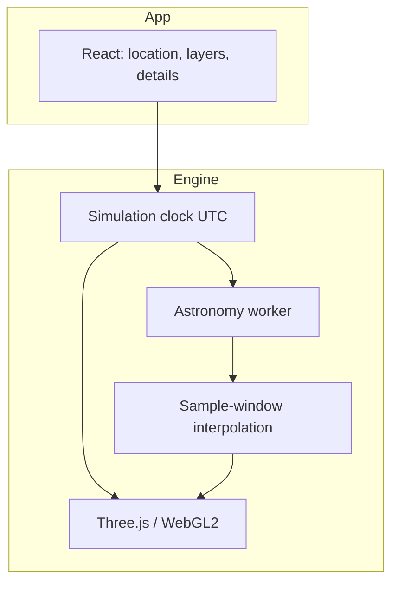

# Ad Astra

English | [简体中文](README.zh-CN.md)

Ad Astra is an interactive, offline-capable real-time sky app for the web. Given an observing site and a moment in time, it reconstructs the local sky in the browser: bright stars, constellations, the Sun, Moon, and planets, and how they change with Earth's rotation and orbit.

It is a popular-science sky simulation: close enough to what you see with the naked eye to learn the constellations, rising and setting, and the day–night cycle. It is not a basis for professional observing, navigation, or research-grade computation.

**Preview**: [https://adastra.zhangzhicheng.info/](https://adastra.zhangzhicheng.info/)

## What you can do

- **The sky at any place and time**: Choose Shanghai, Beijing, London, New York, or Sydney, or enter latitude and longitude; set the date and time in the local time zone.
- **Look around freely**: Drag to change azimuth and altitude, zoom with the wheel or trackpad; jump to east, south, west, north, or the zenith.
- **Step through time**: Play, pause, scrub an ~8-hour timeline, or step forward and back by the hour; rates range from real time to 1 day per second.
- **Main objects**: Bright stars, constellation lines, the Sun, the Moon, and Mercury through Neptune. Click for name, magnitude, azimuth, altitude, and lunar phase.
- **Layers**: Stars, Milky Way, constellations, planets, horizon and ground, objects below the horizon, daylight, ecliptic, celestial equator, equatorial grid, and horizontal grid can each be toggled.
- **Sky density**: A limiting magnitude controls how many stars are drawn. Smaller numbers are brighter, so fewer stars appear.
- **Day and night**: Sky color and star visibility change continuously with the Sun's altitude, through daylight, civil / nautical / astronomical twilight, and night.
- **Offline**: The production build includes a Service Worker; after the first load, the app can open offline.

## How it works

The observing site decides which part of the sky is overhead. The absolute instant decides how far the celestial sphere has turned. Stars are fixed on that sphere and, each frame, a single horizon matrix maps them into the local sky. The Sun, Moon, and planets are recomputed from dynamics at each instant, then mapped into the same horizontal coordinates. The picture shows directions, not distances.

Further reading (Chinese):

- [Astronomy](docs/astronomy.md): celestial sphere, time scales, coordinate transforms, diurnal motion, planetary apparent motion, refraction, lunar phase, and day/night.
- [Technical notes](docs/technical.md): layering, the clock, worker sampling, rendering, picking, and data formats.
- [Product design](docs/product-design.md): interaction and UI rules.

## Technical approach

A static frontend PWA. There is no runtime backend:



- **UI**: React holds only low-frequency state (location, layers, selection). View and time live on a `ref`, so React does not re-render every frame.
- **Clock**: UTC milliseconds are the only simulation time; the UI displays IANA time zones. Playback advances by `performance.now()` times a rate, so dropped frames do not drift simulation time.
- **Stars**: A magnitude-sorted binary catalog is built at compile time and uploaded as GPU point sprites. Time changes update a matrix, not the vertex buffer.
- **Solar system**: `astronomy-engine` runs in a Web Worker; the main thread spherically / angularly interpolates between adjacent samples.
- **Rendering**: Three.js + WebGL2. The sky uses a spherical projection rather than a perspective box; stars, Milky Way, helper lines, and bodies are separate layers with custom GLSL.
- **Offline**: Content-hashed static assets are cached by a Service Worker.

The current catalog is a project-maintained bright-star list of about 226 stars (including constellation-line anchors), covering familiar naked-eye constellation structure. The Sun, Moon, and planets are not in the catalog; they are computed live from the ephemeris.

### Stack

React 19, TypeScript, Three.js / WebGL2, Astronomy Engine, Vite 8, Vitest, Service Worker.

## Getting started

### Requirements

- Node.js 20.19+ or 22.12+
- pnpm 10 (enable with `corepack enable` using the `packageManager` field in `package.json`)
- A modern browser with WebGL2 and ES module workers (recent Chrome, Edge, Safari, or Firefox)

### Install and develop

```bash
git clone https://github.com/gunerguner/AdAstra.git
cd AdAstra
pnpm install --frozen-lockfile
pnpm dev
```

The local URL is typically `http://localhost:5173/`. Development mode does not register a Service Worker, so the cache cannot interfere with hot reload.

### Checks and build

```bash
pnpm typecheck
pnpm lint
pnpm test
pnpm verify          # types, lint, tests, and astronomy golden samples
pnpm build
pnpm preview
```

`pnpm build` first generates the runtime catalog from `src/data/stars.yaml`, then writes static output to `dist/`. Deploy to any HTTPS static host or CDN; a Service Worker requires a secure context.

Host locally with Docker:

```bash
cp docker/.env.example docker/.env
docker compose -f docker/docker-compose.yml --env-file docker/.env build
docker compose -f docker/docker-compose.yml --env-file docker/.env up -d
```

The container's port 8080 is mapped to host **8083** by default. Ports, caching, and certificates: [docker/README.md](docker/README.md).

## Layout

```text
src/
  app/          App shell: page assembly and low-frequency React state
  features/     Feature UI (viewport, layers, time, details)
  engine/       Engine (clock / astronomy / coordinates / catalog / render / interaction)
  workers/      Astronomy worker
  data/         Constellation lines, cities, source catalog YAML
  config/       Default layers, playback rates, quick views
  shared/       Types, errors, shared UI
scripts/
  astronomy/    Astronomy golden samples
  catalog/      Catalog packing
  pwa/          Service Worker template
public/data/    Generated runtime catalog
tests/          Unit tests
docs/           Design and principle docs
```

## License

The project is MIT licensed. Third-party dependencies and datasets follow their own licenses.
