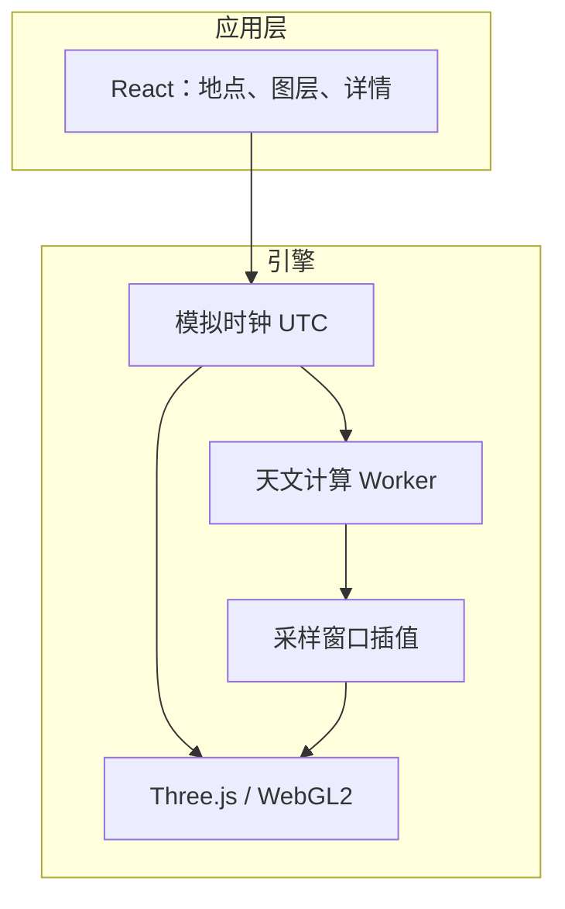

# Ad Astra

[English](README.md) | 简体中文

Ad Astra 是一款可交互、可离线使用的实时星空 Web 应用。给定地球上的观测地点和时刻，它在浏览器里还原当时当地的天空：亮星、星座、太阳、月亮、行星，以及它们随地球自转和公转发生的变化。

定位是科普级星空模拟：让画面与肉眼所见大致相符，用来认识星座、理解东升西落和昼夜更替。不作为专业观测、导航或科研计算依据。

**预览**：[https://adastra.zhangzhicheng.info/](https://adastra.zhangzhicheng.info/)

## 能做什么

- **任意时空下的星空**：选择上海、北京、伦敦、纽约、悉尼，或手动输入经纬度；按当地时区设置日期和时间。
- **自由看天空**：拖拽改变朝向和仰角，滚轮或触控板缩放；可快速切到东、南、西、北和天顶。
- **推演时间**：播放、暂停、拖动约 8 小时的时间轴，或按小时前进后退；倍率从实时到「1 天/秒」。
- **主要天体**：亮星、星座连线、太阳、月亮和水星到海王星。点击可查看名称、视星等、方位角、高度角和月相。
- **图层**：恒星、银河、星座、行星、地平与地面、地平线以下、昼夜效果、黄道、天赤道、赤道网、地平网，均可单独开关。
- **星空密度**：用视星等上限控制画出多少恒星。数值越小越亮、星越少。
- **昼夜**：天空颜色、恒星可见度随太阳高度连续变化，经过白昼、民用/航海/天文曙暮光和夜晚。
- **离线**：生产构建带 Service Worker，首次加载完成后可离线打开。

## 原理

观测地点给出「哪一片天空在头顶」，绝对时刻给出「天球转到了哪一格」。恒星钉在天球上，每帧用同一套地平矩阵转到当地天空；太阳、月亮和行星按力学理论对每个瞬间重新求方向，再转到同一套地平坐标。画面画的是方向，不是距离。

更完整的说明：

- [天文原理](docs/astronomy.md)：天球、时间尺度、坐标变换、周日运动、行星视运动、折射、月相与昼夜。
- [技术说明](docs/technical.md)：分层、时钟、Worker 采样、渲染、拾取与数据格式。
- [产品设计](docs/product-design.md)：交互与界面规则。

## 技术方案

纯前端静态 PWA，运行时不依赖后端：



- **界面**：React 只持有低频状态（地点、图层、选中对象）。视角和时间走 `ref`，不每帧重渲染 React。
- **时钟**：内部以 UTC 毫秒为唯一模拟时间；界面按 IANA 时区显示。播放用 `performance.now()` 按倍率推进，掉帧不会让模拟时间漂移。
- **恒星**：构建期打成按视星等排序的二进制星表；运行时上传为 GPU 点精灵。时间变化只更新矩阵，不重传顶点。
- **太阳系**：`astronomy-engine` 在 Web Worker 中计算；主线程在相邻采样点之间做球面/角度插值。
- **渲染**：Three.js + WebGL2。天空用球面投影而不是透视盒子；恒星、银河、辅助线、天体分图层，自定义 GLSL。
- **离线**：带内容哈希的静态资源由 Service Worker 缓存。

当前星表是项目维护的亮星目录，约 226 颗（含星座连线锚点），覆盖肉眼常见星座结构。太阳、月亮和行星不依赖星表，由星历实时计算。

### 技术栈

React 19、TypeScript、Three.js / WebGL2、Astronomy Engine、Vite 8、Vitest、Service Worker。

## 从零开始运行

### 环境

- Node.js 20.19+ 或 22.12+
- pnpm 10（可用 `corepack enable` 按 `package.json` 的 `packageManager` 启用）
- 支持 WebGL2 和 ES Module Worker 的现代浏览器（Chrome、Edge、Safari、Firefox 近期版本）

### 安装与开发

```bash
git clone https://github.com/gunerguner/AdAstra.git
cd AdAstra
pnpm install --frozen-lockfile
pnpm dev
```

本地地址一般为 `http://localhost:5173/`。开发模式不注册 Service Worker，以免缓存干扰热更新。

### 检查与构建

```bash
pnpm typecheck
pnpm lint
pnpm test
pnpm verify          # 类型、代码、测试和天文黄金样例
pnpm build
pnpm preview
```

`pnpm build` 会先从 `src/data/stars.yaml` 生成运行时星表，再输出静态产物到 `dist/`。可部署到任意支持 HTTPS 的静态服务器或 CDN；Service Worker 需要安全上下文。

用 Docker 本地托管：

```bash
cp docker/.env.example docker/.env
docker compose -f docker/docker-compose.yml --env-file docker/.env build
docker compose -f docker/docker-compose.yml --env-file docker/.env up -d
```

默认把容器 8080 映射到宿主机 **8083**。端口、缓存与证书见 [docker/README.md](docker/README.md)。

## 项目结构

```text
src/
  app/          应用壳：页面装配与低频 React 状态
  features/     功能 UI（视口、图层、时间、详情）
  engine/       引擎（clock / astronomy / coordinates / catalog / render / interaction）
  workers/      天文计算 Worker
  data/         星座连线、城市、源星表 YAML
  config/       默认图层、播放倍率、快捷视角
  shared/       类型、错误、通用 UI
scripts/
  astronomy/    天文黄金样例
  catalog/      星表打包
  pwa/          Service Worker 模板
public/data/    构建生成的运行时星表
tests/          单元测试
docs/           原理与设计文档
```

## License

项目使用 MIT License。第三方依赖与数据集遵循各自的许可证。
