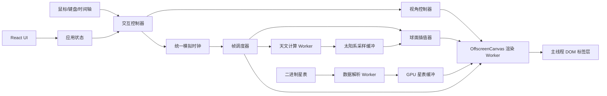

# Ad Astra 实时星空技术设计文档

## 1. 文档信息

- 文档版本：V1.0
- 编写日期：2026-08-17
- 上游文档：`docs/product-design.md`
- 目标平台：桌面端 Web
- 部署形态：静态 PWA，首次完成资源缓存后可离线运行
- 浏览器范围：Chrome、Edge、Safari、Firefox 近两个主版本
- 授权目标：优先公共领域、CC0、MIT、BSD 等可商用来源
- 技术重点：数据源与授权、连续时间交互、渲染性能

## 2. 结论摘要

推荐采用自研轻量星空引擎：

- 应用层：React + TypeScript + Vite。
- 渲染层：Three.js `WebGLRenderer` + WebGL2；能力检测通过时运行于 OffscreenCanvas 渲染 Worker，否则回退主线程。
- 天文计算：Astronomy Engine，放入独立计算 Worker。
- 恒星渲染：单批次 GPU 点精灵，自定义 ShaderMaterial。
- 时间动画：统一模拟时钟 + 精确采样 + 帧间球面插值。
- 数据分发：构建期裁剪、规范化和二进制打包；运行时不依赖远程天文 API。
- 离线能力：Service Worker 缓存应用壳、核心星表和扩展星表。
- 星表策略：NASA/USNO 候选数据源 + 商业发布前书面授权核验门禁。

不直接采用 Stellarium Web Engine，主要原因是 AGPL/商业双授权、数据依赖和功能体量超出本项目需要；不采用 Canvas2D 作为主渲染路径，主要原因是大量恒星、连续时间动画和高频交互下的性能余量不足。

## 3. 需求到技术能力映射

### 3.1 任意地点与时间

- 所有计算使用 UTC 对应的绝对时刻。
- 界面本地时间通过 IANA 时区转换。
- 观测位置由经纬度和海拔构成；MVP 海拔缺省为 0 米。
- 支持当前年份前后至少 200 年。

### 3.2 星空内容

- 恒星：构建期生成不暗于 `+8.0` 视星等的本地星表。
- 星座：自有星座连线定义、名称和锚点数据。
- 太阳、月亮、主要行星：运行时通过 Astronomy Engine 计算。
- 黄道、天赤道、天球网格、地平网格：运行时参数化生成。

### 3.3 连续时间动画

- 每个渲染帧从同一个模拟时钟读取时间。
- 恒星和辅助线通过全局旋转矩阵连续更新。
- 太阳、月亮、行星使用相邻精确采样点做球面插值。
- 时间轴拖动期间只处理最新目标，过时计算主动丢弃。

### 3.4 视角交互

- 鼠标拖拽控制方位角和高度角。
- 滚轮或触控板控制视场角。
- Three.js 相机只表达观察方向和视场，不承担天文坐标计算。

### 3.5 视星等筛选

- 星表按视星等从亮到暗排序。
- 通过二分定位阈值对应的顶点数，再更新 GPU `drawRange`。
- 阈值边界使用 Shader 透明度窗口平滑淡入淡出。

## 4. 技术约束与假设

### 4.1 已确认约束

- 不依赖运行时后端服务。
- 核心功能在断网状态下可用。
- 数据与依赖必须具备清晰的商业使用依据。
- WebGL2 是所有目标浏览器的共同生产能力。
- WebGPU 不作为 MVP 必需能力。
- 精度为科普级，不用于专业观测和导航。

### 4.2 技术假设

- 默认只加载视星等不暗于 `+5.5` 的核心星表。
- `+5.5` 至 `+8.0` 的扩展星表在首屏可交互后后台加载。
- 完成扩展包缓存后，产品才显示“完整离线数据已就绪”。
- 恒星数量上限以最终获得授权的数据源为准。
- 大气折射使用标准模型，不接入实时天气。
- MVP 不显示卫星、彗星、小行星和深空天体。

## 5. 方案比较与决策

### 5.1 推荐方案：自研 Three.js 星空引擎

组成：

- React 负责界面和业务状态。
- Three.js 负责相机、WebGL2 管线和批量绘制。
- 自定义 GLSL 负责恒星位置、大小、颜色和淡入淡出。
- Astronomy Engine 负责太阳系天体和基础坐标变换。
- Web Worker 负责星历采样、时间跳转和数据解析。

优势：

- MIT 许可证，适合商业产品。
- 能精确控制数据体积、帧预算和降级策略。
- 恒星可压缩为少量 GPU Buffer 和一个绘制批次。
- 容易实现项目特有的时间轴、图层和视星等筛选。
- 不受第三方完整天象馆产品架构约束。

代价：

- 需要自建星表流水线。
- 需要自行完成标签避让、拾取和辅助线。
- 需要建立天文正确性回归测试。

结论：采用。

### 5.2 备选方案：Stellarium Web Engine

优势：

- 已有成熟的天象馆能力。
- 覆盖大气、星座、海量星表和多种天文图层。
- C/C++ 经 Emscripten 编译为 WebAssembly/WebGL。

问题：

- AGPL 与商业双授权不符合当前“宽松可商用”优先目标。
- 默认数据体量和运行时数据服务超出静态离线 MVP 范围。
- 引擎内部模型、构建链和界面层改造成本较高。
- 项目只需要其能力子集，整体引入会增加维护和升级风险。

结论：不采用；仅作为交互和天文显示参考。

### 5.3 备选方案：Canvas2D / D3-Celestial

优势：

- 上手快。
- 静态星图和常规缩放实现简单。
- D3-Celestial 代码使用 BSD 许可证。

问题：

- 数据文件包含 Hipparcos、Stellarium 等多来源内容，不能只依据代码许可证判断商业授权。
- Canvas2D 在大量星点、图层和连续时间更新下更依赖 CPU。
- 不利于实现稳定 60 FPS、GPU 点批次和低成本视星等筛选。

结论：不作为生产主方案；可用于离线验证投影结果。

### 5.4 WebGL2 与 WebGPU

MVP 使用 Three.js `WebGLRenderer`：

- WebGL2 在目标浏览器中成熟稳定。
- 当前场景主要是少量绘制批次和大量点顶点，不需要 WebGPU 计算着色器。
- Firefox 对 WebGPU 的生产默认支持仍不适合作为统一基线。
- Three.js WebGPU 渲染器仍处于快速演进阶段。

WebGPU 只作为后续实验：

- 不与 MVP 共用两套业务逻辑。
- 渲染抽象层不得泄漏 WebGL 专属对象到业务层。
- 只有基准测试证明存在明确收益时才迁移。

## 6. 总体架构



### 6.1 分层

#### 应用层

- 路由与页面布局。
- 地点、时间、图层和偏好设置。
- 错误提示、加载状态和离线状态。

#### 领域层

- 统一模拟时钟。
- 观测者、时间和可见图层状态。
- 时间播放状态机。
- 质量等级状态机。

#### 天文计算层

- 时间尺度转换。
- 坐标系转换。
- 恒星历元传播。
- 太阳、月亮、行星位置计算。
- 黄道、天赤道和坐标网格生成。

#### 渲染层

- 星空相机。
- 恒星点批次。
- 太阳系天体精灵。
- 星座线段。
- 辅助线。
- 地平线与昼夜背景。
- 标签投影和避让。

#### 数据层

- 星表和名称数据。
- 星座连线。
- 城市与时区预设。
- 数据版本和授权清单。
- IndexedDB/Cache Storage 缓存。

## 7. 模块边界

### 7.1 `SimulationClock`

职责：

- 保存当前模拟儒略日。
- 管理播放方向和速度。
- 基于真实单调时钟推进模拟时间。
- 在暂停、后台恢复和时间轴拖动时保持状态确定。

禁止：

- 直接修改 React 组件。
- 执行星历计算。
- 根据渲染帧数量累加时间。

### 7.2 `AstronomyService`

职责：

- 封装 Astronomy Engine。
- 将输入时间和观测者转换为太阳系天体的方向和附加信息。
- 生成赤道系到地平系的旋转矩阵。
- 提供月相、太阳高度角等低频信息。

所有第三方天文库调用必须封装在该模块，业务和渲染层不得直接依赖第三方 API。

### 7.3 `CatalogService`

职责：

- 加载并校验二进制星表。
- 将 ArrayBuffer 转换为 TypedArray 视图。
- 提供名称、星座锚点和选中对象查询。
- 根据版本和校验和决定是否使用缓存。

### 7.4 `SkyRenderer`

职责：

- 创建和销毁 Three.js 资源。
- 管理各渲染图层及绘制顺序。
- 接收只读帧快照。
- 上报帧耗时、绘制批次和上下文丢失。

禁止：

- 自行推进时间。
- 发起星历计算。
- 直接修改应用状态。

### 7.5 `InteractionController`

职责：

- Pointer Events、滚轮和键盘输入。
- 指针捕获和拖拽惯性。
- 相机方位、高度和视场角约束。
- 时间轴手势和过时任务取消。
- 天体拾取。

### 7.6 Worker

`astronomy.worker.ts`：

- 太阳、月亮和行星精确采样。
- 长跨度跳转终点计算。
- 数据解析和可选的星表历元传播。

`render.worker.ts`：

- 持有 OffscreenCanvas、Three.js Renderer 和 WebGL2 上下文。
- 使用 Worker `requestAnimationFrame` 独立提交渲染帧。
- 消费主线程发送的最新输入快照，不处理 DOM。
- 将少量标签屏幕锚点和性能统计回传主线程。
- 通过 MessageChannel 与计算 Worker 交换星历采样。

运行时必须依次检测：

1. 主线程支持 `transferControlToOffscreen`。
2. Worker 内可创建 WebGL2 上下文。
3. Worker 内支持 `requestAnimationFrame`。

回退顺序：

1. OffscreenCanvas 渲染 Worker + WebGL2 + 计算 Worker。
2. 主线程 WebGL2 + 计算 Worker。
3. 精简 Canvas2D：限制亮星数量、30 FPS 和辅助线。
4. 明确兼容性提示，不允许长期白屏。

OffscreenCanvas 不是功能正确性的依赖；两条 WebGL2 路径必须共用相同帧快照、Shader、数据格式和验收用例。

## 8. 数据源方案

### 8.1 数据源原则

数据进入产品前必须同时满足：

1. 来源可追溯。
2. 数据版本固定。
3. 许可证文本可归档。
4. 商业使用和再分发范围明确。
5. 数据转换过程可复现。
6. 生成物带来源和校验和。
7. 不因聚合或镜像站许可证而忽略原始数据权利。

### 8.2 商业发布门禁

星表是当前最大非技术风险。

必须执行以下门禁：

- 开发阶段可使用候选星表验证技术。
- `data/licenses/` 保存原始许可证、来源页面快照和引用要求。
- `data-manifest.json` 记录每个生成文件的源数据和转换脚本版本。
- 商业发布前由负责人完成书面授权核验。
- 未获得明确结论时，不得把候选星表打入生产包。
- 若数据源包含 ESA Gaia、Hipparcos 或 Tycho 数据，必须获得 ESA 商业授权或替换相关记录。

该门禁是发布阻断项，不是普通文档待办。

### 8.3 恒星目录候选

#### Gaia DR3

特点：

- 精度和规模最佳。
- 包含位置、视差、自行和多波段测光。

授权结论：

- ESA 官方页面标注 `CC BY-NC 3.0 IGO`。
- 商业使用需要向 ESA 申请授权。

结论：

- 不作为默认商业数据源。
- 可作为内部精度验证源。
- 获得 ESA 书面商业授权后才可进入生产候选。

#### Hipparcos / Tycho

特点：

- 亮星覆盖适合星空产品。
- 星座连线生态通常使用 HIP 编号。

授权结论：

- ESA 官方页面同样标注 `CC BY-NC 3.0 IGO`。

结论：

- 未获得 ESA 商业授权时不得直接分发。
- 任何包含其字段或记录的派生星表也需做源级核验。

#### HYG v4

特点：

- 约 12 万颗恒星。
- 字段易用，适合浏览器。
- 包含名称、位置、视星等、颜色和自行。

授权结论：

- 项目标注 `CC BY-SA 4.0`。
- 商业使用本身并未被禁止，但派生数据库需要署名和相同方式共享。
- 数据聚合自 Hipparcos、Yale、Gliese，仍需核验上游来源条款。

结论：

- 可作为开发原型数据。
- 当前严格商业发布策略下不直接作为最终生产源。

#### NASA HEASARC BSC5P

特点：

- 9,110 个对象，主要覆盖不暗于约 `+6.5` 的肉眼星。
- 包含 V 视星等、色指数、光谱型、J2000 位置、自行及常用目录标识。
- NASA Data.gov 当前将该数据集标注为 U.S. Government Work。

风险：

- HEASARC 版本派生自 Yale Bright Star Catalog。
- 聚合站的政府作品标记不自动消除原始目录可能存在的权利。

结论：

- 作为核心亮星、名称和显示字段的优先候选。
- 必须对具体下载包和原始 Yale 条款完成书面核验。

#### SAO Star Catalog

特点：

- 约 25.9 万颗恒星，覆盖到约 `V = 9`，满足 `+8.0` 扩展范围。
- 包含 J2000 位置、自行、V 视星等和光谱型等字段。
- NASA 机器可读资料标注为美国政府工作、允许公共使用。

风险：

- 数据年代较早，精度低于 Gaia。
- 仍需归档具体分发文件、修订来源和使用条款。

结论：

- 作为扩展星表的优先候选。
- 与 BSC5P 合并时按稳定交叉标识去重，并优先保留质量更高字段。

#### NASA SKY2000

特点：

- 约 30 万颗、主要覆盖不暗于 `+8.0` 的恒星。
- 包含位置、自行、亮度和颜色等字段。
- 数据规模与本产品视星等范围高度匹配。
- NASA 技术资料标注为美国政府工作，可公共使用。

风险：

- SKY2000 是编译型目录，部分字段来自 Hipparcos/Tycho 等外部目录。
- NASA 数据政策明确要求对非 NASA 原始数据继续核验上游权利。

结论：

- 作为 BSC5P + SAO 组合的备选和数据管线基准。
- 商业上线前必须获得其具体分发包的书面授权结论。

#### USNO UCAC4

特点：

- NASA Open Data Portal 标注为 U.S. Government Work。
- 提供位置、自行以及部分 APASS `B/V/g/r/i` 测光。
- 数据规模约 1.13 亿，不适合直接进入浏览器。

风险：

- 亮星补充数据包含 Hipparcos/Tycho。
- 完整数据过大，必须构建期查询和裁剪。
- 并非所有记录都有统一可靠的 Johnson V 视星等。

结论：

- 作为 SKY2000 的备选和交叉校验源。
- 只允许通过可复现脚本提取 `V <= 8` 的必要字段。
- 商业发布仍需核验被选记录的来源标记。

### 8.4 最终星表策略

优先验证 `BSC5P 核心亮星 + SAO 扩展星` 组合，同时保留 SKY2000/UCAC4 适配器。技术方案不把运行时代码绑定到某个目录编号体系。

定义内部稳定 ID：

```text
internalStarId = hash(sourceNamespace + ":" + sourceObjectId)
```

生产数据源确认后，只替换构建期适配器：

```text
Raw Catalog
  -> Source Adapter
  -> License Filter
  -> Field Normalizer
  -> Quality Filter
  -> Magnitude Sort
  -> Binary Pack
  -> Manifest + Checksums
```

运行时只读取统一字段：

- 内部 ID。
- J2000/ICRS 单位方向向量。
- 单位方向向量年变化率。
- Johnson V 或明确标注的近似 V 视星等。
- B-V 色指数；缺失时使用中性颜色。
- 名称索引。
- 星座锚点标记。
- 数据质量标记。

### 8.5 星表分包

生成以下文件：

```text
public/data/v1/
  manifest.json
  stars-core.bin
  stars-extended.bin
  star-names.zh-CN.json
  constellations.bin
  cities.json
  licenses.json
```

`stars-core.bin`：

- 视星等 `<= +5.5`。
- 首屏加载。
- 所有星座连线需要的锚点星必须包含。

`stars-extended.bin`：

- `+5.5 < 视星等 <= +8.0`。
- 首屏可交互后后台加载。
- 完成缓存后提供完整离线能力。

### 8.6 星表二进制格式

采用 Structure of Arrays，便于零拷贝构建 TypedArray：

```text
Header
  magic: "ADST"
  schemaVersion: uint16
  sourceVersion: uint16
  starCount: uint32
  epochJulianYear: float64
  offsets...

Columns
  positionX/Y/Z: float32[]
  motionX/Y/Z: float32[]
  magnitude: int16[]       // centimag
  colorBV: int16[]         // millimag，缺失使用哨兵值
  internalId: uint32[]
  flags: uint16[]
```

设计原因：

- 位置和自行直接上传 GPU，无需逐条对象化。
- 视星等单独连续存放，可二分查找。
- 避免 JSON 数字解析和大量短生命周期对象。
- 内存中使用 ArrayBuffer 切片，不重复复制。

精度：

- `float32` 单位向量足以满足科普级角度显示。
- 自行使用 `float32`，避免高自行星在 200 年跨度下溢出。
- 视星等保存到 0.01 等级，超过界面 0.5 步长需求。

### 8.7 星座数据

IAU 正式定义的是 88 个星座的边界，不是星座内部连线。

MVP 策略：

- 星座名称、缩写和边界定义参考 IAU。
- 星座连线由项目自行维护，不复制未明确授权的第三方连线文件。
- 每条连线使用内部恒星 ID 表示。
- 连线数据由人工评审，形成项目自有数据资产。
- 星座名称锚点使用球面坐标，不使用屏幕绝对位置。

数据示例：

```json
{
  "id": "ORI",
  "nameZh": "猎户座",
  "nameLatin": "Orion",
  "segments": [[1001, 1002], [1002, 1003]],
  "labelAnchorEqj": [0.12, -0.34, 0.93]
}
```

如后续显示官方边界，可引入 IAU/Davenhall & Leggett VI/49 数据，但仍需归档具体来源和使用条款。

### 8.8 太阳、月亮和行星

主方案使用 Astronomy Engine：

- MIT 许可证。
- JavaScript/TypeScript 可直接在浏览器 Worker 运行。
- 官方目标精度为与 NOVAS/JPL 结果相比始终在约 1 角分以内。
- 使用裁剪后的 VSOP87、NOVAS 模型和经过验证的坐标变换。
- 代码体积远小于 JPL 二进制星历。

JPL DE440/DE442：

- DE440 和后续 DE442 的完整星历覆盖约 1550 至 2650 年，满足本项目范围。
- 完整文件约 114 MB，不适合静态 Web 首屏和离线包。
- 约 31 MB 的短版只覆盖约 1849 至 2150 年，无法覆盖 2026 前后完整 200 年。
- 不进入生产运行时。
- 作为离线测试基准，用固定日期和地点对 Astronomy Engine 结果做回归验证。

Swiss Ephemeris：

- AGPL/商业双授权。
- 当前授权目标下不采用。

ERFA：

- BSD 3-Clause。
- 适合作为高精度基础坐标算法备选。
- 需要 C/WASM 构建链，且本身不替代完整太阳系星历。
- MVP 先通过坐标内核接口使用 Astronomy Engine；若与 ERFA/JPL 黄金样例对比无法满足精度预算，再切换为 Astronomy Engine 行星矢量 + ERFA/WASM 坐标变换的混合方案。

### 8.9 地点和时区

城市：

- 使用 GeoNames `cities15000` 生成有限城市列表；数据为 CC BY 4.0。
- 只保留城市名称、国家、经纬度和 IANA 时区 ID。
- 中文名称单独维护，不从授权不明确的地图服务抓取。

任意经纬度：

- 不在浏览器内打包全球时区边界。
- 手动经纬度默认使用浏览器时区。
- 用户可显式选择 IANA 时区。
- 界面明确区分“观测地点”和“显示时区”。

时间规则：

- 使用浏览器 `Intl.DateTimeFormat` 和 IANA tzdb。
- 如 Temporal 未达到全部目标浏览器一致性，使用官方 Temporal polyfill 或轻量封装。
- 不自行维护夏令时规则。
- 1970 年以前的历史时区数据覆盖不完整，未来 200 年的 DST 法规也不可预测。
- 历史或远期页面必须标识“民用时间规则为近似”，并允许切换 UTC、固定偏移或手动时区。

### 8.10 数据构建流水线

构建脚本必须完成：

1. 下载固定版本源数据。
2. 校验源文件 SHA-256。
3. 保存来源 URL、访问日期和许可证快照。
4. 解析源格式。
5. 根据来源标记执行许可证过滤。
6. 归一化历元、坐标、视星等和色指数。
7. 过滤错误、重复和质量不足记录。
8. 生成自行向量。
9. 按视星等排序和分包。
10. 生成二进制文件。
11. 生成 manifest、许可证清单和目标文件 SHA-256。
12. 运行固定样例和记录数断言。

禁止：

- 手工修改最终二进制文件。
- 在构建时查询未固定版本的“最新”数据。
- 忽略缺失许可证或来源字段继续生产构建。

## 9. 天文计算设计

### 9.1 时间模型

内部权威时间使用：

```ts
type AstroTime = {
  utcMillis: number
  julianDayUt: number
  julianDayTt: number
  quality: 'observed' | 'historical-model' | 'future-model'
}
```

规则：

- UI 输入首先解析为带 IANA 时区的本地时间。
- 转换为 UTC 后才进入模拟时钟。
- 显示时再从 UTC 转回目标时区。
- 运行时不使用本地 `Date` 字段直接做天文运算。
- 动画推进基于 `performance.now()`，避免系统时钟调整造成跳变。
- `utcMillis` 在 UTC 建立之前表示便于软件处理的前推 UTC-like 坐标，不能解释为当时真实存在的官方 UTC。

### 9.2 UTC、UT1 与 TT

科普级方案：

- 现代已知时间范围内近似 `UT1 ≈ UTC`。
- 在现行 UTC 规则下，UT1 与 UTC 的差异约受控在 1 秒以内，对地球自转角影响为十几角秒量级。
- TT 由 Astronomy Engine 的 Delta-T 模型处理。
- 不下载实时 IERS DUT1 文件。

边界：

- 该简化满足科普级展示。
- 1826 至 UTC 建立前：输入解释为历史模拟民用时刻，并近似对应 UT1。
- 超过已发布时区和地球自转预测范围：输入解释为未来模拟民用时刻，使用 Delta-T 预测模型。
- 未来闰秒、UTC 政策和 DST 法规不可预知，结果必须带 `future-model` 标识。
- 详情页不得宣称专业测量精度。
- 若未来升级到观测级，需引入闰秒表和 IERS Earth Orientation Parameters。

### 9.3 坐标系

使用以下坐标层：

1. ICRS/J2000 赤道坐标：恒星目录基础坐标。
2. 日期赤道坐标：应用岁差、章动和必要视位置修正。
3. 地平坐标：基于观测者经纬度和地球自转。
4. 相机坐标：基于用户方位、高度和视场角。
5. 裁剪/屏幕坐标：由 GPU 投影生成。

矩阵链：

```text
catalog vector
  -> proper motion at target epoch
  -> equator-of-date rotation
  -> local horizon rotation
  -> view rotation
  -> perspective projection
```

坐标算法必须位于可替换的 `CoordinateKernel` 接口后。首版由 Astronomy Engine 实现；ERFA/WASM 实现作为精度门禁失败后的替换路径，避免业务和渲染层依赖具体库。

### 9.4 恒星自行

构建期把赤经、赤纬和自行转换为：

- J2000 单位方向 `p0`。
- 每儒略年方向变化率 `dp/dt`。

运行时：

```text
p(epoch) = normalize(p0 + dp/dt * deltaJulianYears)
```

实现位置：

- 默认在恒星顶点着色器执行。
- `deltaJulianYears` 为统一浮点 uniform。
- 岁差、章动、地球自转和观测者变换合并为 3×3 uniform 矩阵。

优势：

- 时间变化时不重传恒星 GPU Buffer。
- 每帧只更新少量 uniform。
- 百年跨度仍可表现高自行恒星移动。

限制：

- 默认忽略透视加速度和径向速度造成的高阶变化。
- 对已知极高自行近星，可通过特殊标记使用 CPU/Worker 6D 传播结果覆盖。
- ±200 年内误差必须通过固定高自行星样例验证。

### 9.5 太阳、月亮和行星

计算结果统一为：

```ts
type BodySample = {
  body: BodyId
  utcMillis: number
  horizontalDirection: [number, number, number]
  altitudeDeg: number
  azimuthDeg: number
  distanceAu?: number
  phase?: number
}
```

要求：

- 使用观测者位置计算地心或站心视位置。
- 月亮必须使用站心位置，否则视差会明显。
- 太阳高度角驱动白昼、暮光和夜间背景。
- 行星只渲染为科普级点或小型精灵，不尝试真实盘面。

### 9.6 大气折射

MVP：

- 使用标准温压下的简化折射模型。
- 只在高度角接近地平线且对象位于有效范围时应用。
- 地平线以下对象不强行折射到可见区域。
- 不接入天气和海拔温压修正。

显示说明：

- 结果是标准大气近似。
- 地平线附近实际位置可能受当地天气和地形影响。

### 9.7 黄道与天赤道

天赤道：

- 在日期赤道坐标系中生成 `Dec = 0` 的球面大圆。
- 采样点转换到地平坐标后绘制。

黄道：

- 根据日期黄赤交角生成。
- 不使用固定屏幕曲线。
- 与日期、视角和投影同步更新。

采样：

- 大圆基础采样 256 点。
- 根据视场角和曲率自适应细分。
- 屏幕相邻点间距目标不超过 8 像素。

### 9.8 天球网格

赤经/赤纬网格：

- 基于日期赤道坐标系生成。
- 网格间隔根据视场角选择，例如 30°、15°、5°、1°。

方位/高度网格：

- 基于观测者地平坐标生成。
- 不随恒星时旋转，只随相机和地点语义变化。

网格标签：

- 由 CPU 选择少量锚点。
- 使用 DOM 标签层显示。
- 标签更新频率低于星空渲染频率。

### 9.9 精度预算

MVP 验收目标：

- 太阳、主要行星：与 JPL Horizons 对比角误差不超过 3 角分。
- 月亮：与 JPL Horizons 对比角误差不超过 5 角分。
- 亮星：当前年份前后 200 年内，与选定基准对比不超过 5 角分。
- 黄道、天赤道和网格：屏幕误差不超过 1 像素或对应 3 角分中的较宽者。
- 地平线附近大气折射不纳入上述严格误差。

这些指标高于“肉眼基本一致”的产品要求，同时给数据源和简化模型保留余量。

## 10. 渲染设计

### 10.1 场景约定

采用右手坐标：

- `+Y`：天顶。
- `+Z`：北。
- `+X`：东。

水平单位向量：

```text
x = cos(altitude) * sin(azimuth)
y = sin(altitude)
z = cos(altitude) * cos(azimuth)
```

必须在单元测试中锁定方位角零点和增大方向，避免东西镜像。

### 10.2 相机

- PerspectiveCamera。
- 相机位置固定在单位球中心。
- 通过方位角和高度角生成观察四元数。
- 不允许 roll，避免普通用户迷失方向。
- 高度角限制在合理范围，查看天顶时使用稳定特殊处理。
- 视场角建议限制在 20° 至 100°。

### 10.3 图层顺序

从后到前：

1. 天空背景和昼夜颜色。
2. 地平线以下遮罩。
3. 扩展恒星。
4. 核心恒星。
5. 星座连线。
6. 黄道、天赤道和坐标网格。
7. 太阳、月亮和行星。
8. 选中高亮。
9. DOM 标签与 UI。

### 10.4 恒星

使用一个或两个 `THREE.Points`：

- 核心星表一个批次。
- 扩展星表一个批次。
- 每个批次使用 `BufferGeometry + ShaderMaterial`。
- 禁止每颗恒星创建 Mesh、Sprite 或 React 元素。

顶点着色器职责：

- 自行传播。
- 应用天文旋转矩阵。
- 视星等到点大小映射。
- 计算颜色和可见性。
- 地平线下裁剪。

片元着色器职责：

- 圆形点精灵。
- 中心亮度和边缘柔化。
- 视星等阈值淡入淡出。
- 白昼亮度抑制。

点大小必须限制上下界，避免高 DPI 屏幕上亮星过大。

### 10.5 视星等筛选

数据按亮到暗排序。

阈值变化：

1. 在 CPU 的 `Int16Array magnitude` 上二分查找。
2. 得到完全可见数量。
3. 使用 `geometry.setDrawRange()` 调整绘制数量。
4. 阈值附近约 `0.15` 星等范围使用 Shader alpha 过渡。

拖动滑块时：

- 不重新排序。
- 不重建 BufferGeometry。
- 不创建恒星对象。
- 不上传整份星表。

星座锚点：

- 关键恒星位于独立的小型锚点 Buffer。
- 即使被筛选隐藏，也可用弱化样式支持星座连线。

### 10.6 星座与辅助线

- 使用 `LineSegments` 合并绘制。
- 每类辅助线最多一个绘制批次。
- 图层显隐只修改 `visible` 或 uniform。
- 网格密度变化时复用预分配 Buffer，避免频繁分配。
- 线条在广角视图中按球面细分，避免长弦穿过天球内部。

### 10.7 太阳系天体

- 太阳、月亮和行星使用单个 InstancedMesh 或少量 Sprite 批次。
- 屏幕尺寸采用视觉可辨认大小，不按真实角直径完全缩放。
- 点击范围与视觉大小分离。
- 月相可在片元着色器中根据太阳方向生成明暗面。

### 10.8 标签

只允许有限标签进入 DOM：

- 当前选中对象。
- 太阳、月亮和主要行星。
- 星座名称。
- 少量高优先级亮星。
- 辅助线标签。

标签流程：

1. 从 3D 方向投影到屏幕。
2. 剔除视锥外和地平线下对象。
3. 按优先级排序。
4. 使用屏幕网格做近似碰撞检测。
5. 更新 `transform: translate3d(...)`。

使用渲染 Worker 时，Worker 每次只回传有限标签的对象 ID、屏幕锚点、可见性和快照 revision；主线程拒绝旧 revision，避免标签跟随过期画面。

更新频率：

- 高质量：30 Hz。
- 平衡：15 Hz。
- 降级：10 Hz。

恒星点保持 60 Hz，标签不要求每帧布局。

### 10.9 拾取

不使用每颗恒星独立 Three.js 对象。

流程：

- 将点击点转换为相机射线。
- 使用预构建的球面分区索引获取候选恒星。
- 对候选方向与射线计算夹角。
- 投影到屏幕后选取点击半径内最近且优先级最高对象。

索引可使用简化 HEALPix 或固定赤经/赤纬网格。

点击半径：

- 鼠标建议 6 至 10 CSS 像素。
- 与设备像素比无关。
- 太阳、月亮和行星优先于恒星。

### 10.10 昼夜背景

根据太阳高度角分段插值：

- 白昼。
- 民用暮光。
- 航海暮光。
- 天文暮光。
- 夜间。

背景变化使用连续函数，不在高度角边界突变。

恒星可见度：

- 白昼时按太阳高度和恒星亮度抑制。
- “始终显示恒星”开启后绕过物理可见性抑制，但保留产品提示。

## 11. 时间与动画设计

### 11.1 权威模拟时钟

状态：

```ts
type ClockState =
  | { mode: 'paused'; utcMillis: number }
  | { mode: 'playing'; anchorUtcMillis: number; anchorMonoMs: number; rate: number }
  | { mode: 'scrubbing'; utcMillis: number; generation: number }
  | { mode: 'settling'; from: number; to: number; startedMonoMs: number }
```

播放时间：

```text
simulationUtc =
  anchorUtcMillis +
  (performance.now - anchorMonoMs) * rate
```

不得使用：

```text
simulationUtc += fixedStepPerFrame
```

否则掉帧会导致模拟时间变慢或漂移。

### 11.2 帧快照

每帧开始生成不可变快照：

```ts
type FrameSnapshot = {
  utcMillis: number
  observer: Observer
  view: ViewState
  layers: LayerState
  magnitudeLimit: number
  quality: QualityLevel
}
```

本帧所有模块使用同一快照：

- 恒星矩阵。
- 行星插值。
- 辅助线。
- 标签。
- 昼夜背景。
- 状态栏显示。

避免同一帧内出现时间不一致。

### 11.3 星历采样

Worker 维护每个天体的相邻采样点：

```text
sample A <= current time <= sample B
```

渲染帧对方向做球面线性插值：

```text
direction = slerp(directionA, directionB, t)
```

采样间隔自适应：

- 月亮比行星更高频。
- 视场越小，允许的角误差越小。
- 播放倍速越高，采样窗口越大但仍需控制屏幕误差。
- 暂停和时间轴松手后立即计算准确终点。

采样目标：

- 插值屏幕误差不超过 0.5 像素。
- 精确采样响应通常小于 50 毫秒。

### 11.4 时间轴拖动

拖动事件只更新最新目标：

```ts
generation += 1
worker.postMessage({
  type: 'sample-at',
  generation,
  utcMillis
})
```

Worker 返回：

```ts
if (response.generation !== currentGeneration) {
  discard(response)
}
```

交互阶段：

1. 指针按下进入 `scrubbing`。
2. UI 每帧合并 Pointer Move，不逐事件计算。
3. 恒星矩阵直接响应最新时间。
4. 行星使用最近结果预测，并异步请求新采样。
5. 快速拖动时降低标签、扩展星和背景刷新频率。
6. 松手后计算精确终点。
7. 300 毫秒内平滑收敛到准确结果。

### 11.5 连续播放

- 星星和辅助线每帧通过时间矩阵变化。
- 行星使用采样插值。
- 切换倍速时对 `rate` 做 100 至 200 毫秒缓变。
- 暂停不吸附到采样点。
- 页面进入后台时记录暂停时刻，不补播后台时间。

### 11.6 年、十年和百年跳转

大跨度跳转不按真实角速度播放全过程：

1. 计算目标时间准确状态。
2. 视情况选择球面插值或短暂淡出/淡入。
3. 过渡时长固定在 500 至 1500 毫秒。
4. 明确显示目标年份。
5. 新请求到达时取消旧请求。
6. 动画结束必须使用准确目标状态覆盖插值状态。

对于路径语义可能误导的天体，不展示虚假的“最短轨道飞行”，改用短时过渡和时间信息。

### 11.7 交互优先级

从高到低：

1. 当前指针或键盘输入。
2. 最新时间/地点目标。
3. 精确终点计算。
4. 自动播放。
5. 标签与装饰效果。
6. 后台预加载。

任何低优先级任务不得阻塞高优先级输入。

## 12. 性能设计

### 12.1 目标环境

基准机建议至少包含：

- 中端 Windows 笔记本，集成显卡，1920×1080。
- Apple Silicon MacBook Air。
- Intel Mac 或较旧集成显卡设备。
- 2× 设备像素比屏幕。

浏览器：

- Chrome。
- Edge。
- Safari。
- Firefox。

### 12.2 首屏预算

目标：

- 页面框架 1 秒内可见。
- 首个可交互星空 3 秒内呈现。

压缩后预算：

- HTML/CSS/应用 JS：不超过 600 KB。
- 核心星表与星座：不超过 1.5 MB。
- 首次可交互必要总资源：不超过 2.5 MB。
- 扩展星表：建议不超过 8 MB。

加载顺序：

1. HTML/CSS 和最小应用入口。
2. Three.js、Astronomy Engine 和核心星表并行加载。
3. 先显示核心星空。
4. 空闲时加载扩展星表。
5. 缓存成功后显示完整离线就绪。

### 12.3 帧预算

60 FPS 帧预算约 16.7 毫秒。

推荐分配：

- 主线程输入、UI 和状态快照：P95 不超过 2 毫秒。
- 计算 Worker 天文矩阵和行星采样：不阻塞渲染，单次常规任务不超过 4 毫秒。
- 标签候选与避让：单次不超过 4 毫秒，10 至 15 Hz 执行。
- 渲染 Worker Three.js CPU 编码与提交：P95 不超过 3 毫秒。
- GPU 渲染：P95 不超过 8 毫秒，最低设备不超过 12 毫秒。
- IPC 状态消息每帧最多一次，建议小于 4 KB。

最低 45 FPS 对应约 22.2 毫秒。

硬指标：

- 滚动窗口 P95 帧时长不超过 22.2 毫秒。
- 单次超过 50 毫秒的长帧比例低于 1%。
- 输入到画面反馈低于 100 毫秒。
- 时间轴松手后 300 毫秒内稳定到准确终点。

### 12.4 绘制批次

常规目标不超过 12 次 draw call：

- 背景 1。
- 核心恒星 1。
- 扩展恒星 1。
- 星座 1。
- 黄道 1。
- 天赤道 1。
- 天球网格 1。
- 地平网格 1。
- 太阳系天体 1。
- 地平线和选中高亮 1 至 2。

DOM 标签不计入 WebGL draw call，但必须限制数量。

### 12.5 内存预算

推荐目标：

- JS Heap 稳态小于 100 MB。
- GPU Buffer 小于 32 MB。
- 总页面内存建议小于 180 MB。
- 连续运行 30 分钟，Heap 不持续单调增长。

控制措施：

- 不把星表解析成对象数组。
- 使用 Shared/Transferable ArrayBuffer；默认优先 Transferable。
- 复用帧快照和临时向量。
- 禁止在渲染循环中创建大量 Vector3、数组和闭包。
- 图层关闭时释放不再需要的纹理和几何体。

### 12.6 LOD

恒星 LOD：

- 视星等阈值是第一层 LOD。
- 视场角较大时限制暗星点大小和标签。
- 视场角较小时可显示更多暗星，但仍受用户阈值控制。
- 性能降级可临时限制扩展星显示数量，并明确提示。

标签 LOD：

- 广角只显示星座和太阳系天体。
- 中等视场增加主要亮星。
- 窄视场增加普通亮星。

辅助线 LOD：

- 广角使用稀疏网格。
- 缩放后增加网格密度。

### 12.7 自适应质量状态机

质量等级：

#### High

- DPR 上限 2。
- 扩展星完整显示。
- 标签 30 Hz。
- 柔和光晕和背景效果开启。

#### Balanced

- DPR 上限 1.5。
- 标签 15 Hz。
- 简化光晕。
- 暗星淡入动画简化。

#### Low

- DPR 上限 1。
- 标签 10 Hz。
- 关闭非必要视觉效果。
- 快速交互期间限制扩展星。

触发建议：

- 连续 2 秒 P95 帧时长超过 22.2 毫秒：降一级。
- 连续 2 秒 P95 帧时长超过 33 毫秒：直接进入 Low。
- 连续 5 秒 P95 帧时长低于 16.7 毫秒：尝试升一级。
- 每次只改变一级，避免质量来回抖动。

不可降级：

- 当前模拟时间正确性。
- 太阳、月亮和行星最终位置。
- 主要亮星。
- 用户当前选中对象。
- 时间轴输入响应。

### 12.8 资源缓存

使用：

- HTTP 长缓存和内容哈希文件名。
- Service Worker Cache Storage 缓存静态资源。
- IndexedDB 保存数据版本、用户设置和可选解析结果。

更新策略：

- 新 manifest 下载后先校验全部新文件。
- 新版本完整可用后原子切换。
- 更新失败继续使用上一有效版本。
- 不混用不同版本的星表、名称和星座连线。

### 12.9 WebGL 上下文丢失

- 监听 `webglcontextlost` 并阻止默认销毁流程。
- 暂停模拟播放。
- 保存业务状态。
- 上下文恢复后重建 Renderer、材质和 GPU Buffer。
- 恢复失败时提示刷新页面。

## 13. 状态管理

### 13.1 状态分类

持久业务状态：

- 观测者。
- 显示时区。
- 模拟时钟模式。
- 图层开关。
- 视星等阈值。
- 质量偏好。

高频渲染状态：

- 当前时间矩阵。
- 相机四元数。
- 行星插值方向。
- 指针位置。
- 帧性能统计。

原则：

- 高频渲染状态不进入 React state。
- React 只订阅低频可视状态。
- 渲染器使用独立帧循环和只读快照。
- 可使用 Zustand 管理业务状态，但不让每帧更新触发组件树重渲染。

### 13.2 持久化

Local Storage：

- 图层偏好。
- 视星等阈值。
- 上次观测地点。
- 上次视角。

IndexedDB：

- 数据 manifest。
- 星表版本和缓存元数据。
- 可选的解析后 ArrayBuffer。

精确定位：

- 默认不上传。
- 本地存储前需遵循产品隐私设置。

## 14. Worker 协议

### 14.1 请求

```ts
type WorkerRequest =
  | {
      type: 'INIT'
      generation: number
      observer: Observer
    }
  | {
      type: 'SAMPLE_RANGE'
      generation: number
      fromUtcMillis: number
      toUtcMillis: number
      bodies: BodyId[]
      toleranceArcMin: number
    }
  | {
      type: 'SAMPLE_AT'
      generation: number
      utcMillis: number
      bodies: BodyId[]
    }
  | {
      type: 'SET_OBSERVER'
      generation: number
      observer: Observer
    }
```

### 14.2 响应

```ts
type WorkerResponse =
  | {
      type: 'READY'
      generation: number
    }
  | {
      type: 'SAMPLES'
      generation: number
      samples: BodySample[]
    }
  | {
      type: 'ERROR'
      generation: number
      code: string
      recoverable: boolean
    }
```

### 14.3 取消

- 主线程每次关键输入增加 `generation`。
- Worker 在阶段边界检查 generation。
- 主线程丢弃旧 generation 响应。
- 高频时间轴拖动不创建无限消息队列；每帧最多发送一次最新目标。

## 15. 目录设计

```text
src/
  app/
    App.tsx
    routes.tsx
  features/
    location/
    time-control/
    layer-control/
    object-details/
  engine/
    astronomy/
      AstronomyService.ts
      coordinates.ts
      time.ts
      accuracy.ts
    clock/
      SimulationClock.ts
      PlaybackState.ts
    interaction/
      CameraController.ts
      PickingService.ts
      TimeScrubber.ts
    render/
      SkyRenderer.ts
      StarLayer.ts
      SolarSystemLayer.ts
      ConstellationLayer.ts
      GridLayer.ts
      LabelLayer.ts
      shaders/
    data/
      CatalogService.ts
      binary-schema.ts
      manifest.ts
    performance/
      FrameMonitor.ts
      QualityController.ts
  store/
    app-store.ts
  workers/
    astronomy.worker.ts
    render.worker.ts
  types/
scripts/
  catalog/
    download.ts
    normalize.ts
    license-filter.ts
    pack.ts
    verify.ts
public/
  data/
docs/
  prd
  product-design.md
  technical-design.md
data/
  sources.lock.json
  licenses/
```

## 16. 核心接口

### 16.1 观测者

```ts
type Observer = {
  latitudeDeg: number
  longitudeDeg: number
  elevationMeters: number
  timeZone: string
}
```

### 16.2 图层状态

```ts
type LayerState = {
  stars: boolean
  starNames: boolean
  constellationLines: boolean
  constellationNames: boolean
  solarSystem: boolean
  horizon: boolean
  cardinalDirections: boolean
  ecliptic: boolean
  celestialEquator: boolean
  equatorialGrid: boolean
  horizontalGrid: boolean
  belowHorizon: boolean
  daylightEffect: boolean
}
```

### 16.3 视角

```ts
type ViewState = {
  azimuthDeg: number
  altitudeDeg: number
  fieldOfViewDeg: number
}
```

### 16.4 数据 Manifest

```ts
type DataManifest = {
  schemaVersion: number
  dataVersion: string
  createdAt: string
  epoch: number
  files: Array<{
    path: string
    bytes: number
    sha256: string
    sourceIds: string[]
  }>
  sources: Array<{
    id: string
    name: string
    version: string
    url: string
    licenseId: string
    commercialUseReviewed: boolean
    reviewedAt?: string
  }>
}
```

生产构建断言：

```text
every source.commercialUseReviewed === true
```

否则构建失败。

## 17. 错误处理

### 17.1 数据加载失败

- 核心星表失败：显示错误页并提供重试。
- 扩展星表失败：保持核心星空可用，并提示扩展恒星不可用。
- 校验和失败：删除损坏缓存并重新下载。
- 新版本失败：回退上一完整版本。

### 17.2 Worker 失败

- 捕获 Worker error 和 messageerror。
- 暂停时间播放。
- 尝试重建 Worker 一次。
- 重建失败时保留恒星静态视图，禁用太阳系动画并提示。

### 17.3 天文计算异常

- 输入时间和坐标先做范围校验。
- 结果必须检查有限数、单位向量长度和高度角范围。
- 单个天体失败不影响其他天体。
- 最后有效帧继续显示。

### 17.4 性能异常

- 自动进入降级状态。
- 不自动无限重试高质量。
- 用户可查看当前质量等级。
- 质量降级不改变核心位置计算。

## 18. 测试方案

### 18.1 数据构建测试

- 源文件 SHA-256 与 lock 文件一致。
- 所有生产源完成商业使用核验。
- 恒星 ID 唯一。
- 星表按视星等单调排序。
- 核心包包含全部星座锚点。
- 位置向量长度接近 1。
- 视星等范围符合包定义。
- 输出文件 SHA-256 写入 manifest。
- 相同输入产生字节级一致输出。

### 18.2 天文正确性测试

使用固定样例：

- 北京、伦敦、纽约、悉尼。
- 赤道、北极圈、南极圈附近地点。
- 当前时间、前后 200 年边界。
- 春分、夏至、秋分、冬至附近。
- 月亮靠近地平线。
- 行星冲、合附近。
- 高自行恒星。

对照：

- JPL Horizons 固定导出结果。
- Astronomy Engine 官方测试。
- 独立 ERFA/SOFA 或可信桌面天文软件抽样结果。

测试内容：

- 方位角和高度角。
- 太阳、月亮和行星角距离误差。
- 黄道和天赤道关系。
- 地平线以上/以下判断。
- 东西方向不镜像。

禁止在 CI 中实时调用 JPL 网络服务；基准结果必须固定入库并记录来源时间。

### 18.3 时间动画测试

- 1×、60×、3600× 和极高倍速播放。
- 正向和反向播放。
- 播放中拖拽和缩放。
- 快速拖动时间轴 10 秒。
- 连续发出 100 个跳转目标，最终只落到最后一个。
- 年、十年和百年跳转。
- 标签、星座线、辅助线与星点不脱离。
- 暂停后不吸附。
- 后台 30 秒再恢复不补播。

### 18.4 性能测试

场景：

- 默认 `+5.5`。
- 最大 `+8.0`。
- 所有辅助线开启。
- 最多标签场景。
- 时间播放并同时拖拽。
- 时间轴高速拖动。
- 30 分钟稳定性。

采集：

- FPS。
- P50/P95/P99 帧时长。
- Long Task 数量。
- JS Heap。
- GPU draw call。
- 首次可交互时间。
- Worker 请求和响应延迟。
- 丢弃的过时任务数量。

### 18.5 交互测试

- Pointer Capture。
- 拖拽离开画布后松手。
- 触控板高频滚动。
- 缩放上下限。
- 天顶附近旋转。
- 视星等阈值单调性。
- 图层显隐。
- 恒星、行星和星座拾取优先级。
- 键盘快捷键在输入框内不误触。

### 18.6 浏览器测试

至少覆盖：

- 最新稳定 Chrome。
- 最新稳定 Edge。
- 最新稳定 Safari。
- 最新稳定 Firefox。
- 每种浏览器的上一个主版本。

验证：

- WebGL2 创建。
- Shader 编译。
- Worker 和 Transferable ArrayBuffer。
- Service Worker 更新。
- IndexedDB。
- IANA 时区和夏令时。
- WebGL 上下文恢复。

## 19. 构建与部署

### 19.1 构建

流程：

```text
license check
  -> catalog build
  -> catalog verification
  -> unit tests
  -> type check
  -> app build
  -> bundle budget check
  -> E2E smoke test
```

生产构建失败条件：

- 数据源授权未核验。
- 数据校验和不匹配。
- 首屏包超过预算。
- 关键天文基准超出误差。
- 浏览器冒烟测试失败。

### 19.2 静态部署

- 支持任意静态对象存储或 CDN。
- 所有路由回退到 `index.html`。
- 数据文件使用内容哈希。
- Brotli 和 gzip。
- 正确设置 `.bin` MIME 为 `application/octet-stream`。
- Service Worker 只缓存同版本资源。

### 19.3 PWA

- 应用壳离线可启动。
- 核心星表缓存后支持默认星空。
- 扩展星表缓存后支持完整视星等范围。
- UI 显示当前离线数据状态。
- 数据版本升级采用后台下载和原子切换。

## 20. 可观测性

默认只收集匿名性能信息，且可关闭。

建议指标：

- `first_sky_interactive_ms`
- `catalog_core_load_ms`
- `catalog_extended_load_ms`
- `frame_time_p95_ms`
- `long_frame_ratio`
- `worker_sample_p95_ms`
- `stale_worker_response_count`
- `quality_level_changed`
- `webgl_context_lost`
- `data_integrity_failed`

位置隐私：

- 不记录精确经纬度。
- 如需分析地点，只记录降精度区域或不记录。
- 不上报用户输入的自定义时间和搜索内容。

## 21. 安全与供应链

- 依赖锁文件提交仓库。
- CI 执行依赖漏洞扫描。
- 数据下载脚本仅访问白名单来源。
- 所有源文件和生成文件校验 SHA-256。
- 禁止运行数据包内代码。
- JSON 解析后做 Schema 校验。
- 星体名称作为纯文本渲染，不使用 `innerHTML`。
- Service Worker 必须限定缓存范围和版本。
- 第三方许可证清单随发布包提供。

## 22. 实施阶段

### 阶段 0：数据授权与技术验证

- 建立数据源 lock 和许可证归档。
- 用候选 SKY2000/UCAC4 生成最小星表。
- 完成商业发布门禁脚本。
- 验证 Astronomy Engine 与 JPL 固定样例误差。
- 验证 Three.js 单批次恒星渲染性能。

退出条件：

- 星表方案获得可继续开发的书面结论。
- `+8.0` 场景在基准设备达到 45 FPS。

### 阶段 1：天文核心

- SimulationClock。
- AstronomyService。
- 坐标矩阵。
- 恒星自行。
- 太阳、月亮、行星。
- 黄道、天赤道和网格。
- 天文正确性测试。

### 阶段 2：渲染与交互

- 星空相机。
- 恒星 Shader。
- 图层。
- 时间轴。
- 视星等筛选。
- 拾取和标签。
- Worker 取消协议。

### 阶段 3：性能与离线

- 星表分包。
- Service Worker。
- 自适应质量。
- 内存和帧性能优化。
- 30 分钟稳定性测试。

### 阶段 4：兼容与发布

- 四浏览器测试。
- 可访问性。
- 错误恢复。
- 数据和依赖许可证复核。
- 生产包体与性能门禁。

## 23. 主要风险与应对

### 23.1 星表授权不明确

影响：阻断商业发布。

应对：

- 源级许可证追踪。
- 数据源适配器与运行时格式解耦。
- 商业构建强制检查。
- 必要时申请 ESA 商业授权。

### 23.2 `+8.0` 星表体积过大

影响：首屏和离线缓存变慢。

应对：

- 核心/扩展分包。
- 二进制 SoA。
- Brotli。
- 只保留运行时字段。
- 扩展包后台加载。

### 23.3 时间轴拖动时星历计算追不上

影响：天体跳动或松手后继续追赶。

应对：

- generation 取消。
- 每帧合并输入。
- 恒星矩阵即时响应。
- 行星采样与插值解耦。
- 松手时精确收敛。

### 23.4 标签和星点不同步

影响：破坏 Star Walk 式连续体验。

应对：

- 单一帧快照。
- 标签从同一插值结果投影。
- 标签允许低频，但不允许使用旧时间状态。

### 23.5 Safari/Firefox 性能差异

影响：达不到 45 FPS。

应对：

- WebGL2 共同基线。
- 自动 DPR 和质量降级。
- 浏览器独立性能基准。
- 不依赖 WebGPU。

### 23.6 百年跨度恒星误差

影响：高自行恒星和星座形状偏差。

应对：

- 星表保留自行。
- 高自行星专项样例。
- 关键星可使用更完整空间运动模型。
- 明确科普级精度边界。

### 23.7 时区和夏令时

影响：同一本地时间对应错误绝对时间。

应对：

- 内部天文计算保存 UT/TT 与时间质量标记；UTC 仅用于可可靠定义的现代民用时间。
- 使用 IANA 时区。
- 对重复或不存在的本地时间要求用户确认。
- 任意经纬度允许手动时区，不猜测边界。
- 历史和远期时间允许改用 UTC-like、固定偏移或近似 UT1，并明确提示模型性质。

## 24. 架构决策记录

### ADR-001：WebGL2 作为生产主渲染路径

状态：接受。

原因：

- 四个目标浏览器共同支持。
- 点精灵场景无需 WebGPU 特性。
- 稳定性和调试工具更成熟。

### ADR-002：不引入运行时后端

状态：接受。

原因：

- 核心数据和计算可在浏览器完成。
- 静态部署和离线是已确认约束。
- 避免网络延迟破坏时间交互。

### ADR-003：Astronomy Engine 作为太阳系计算主库

状态：接受。

原因：

- MIT。
- 浏览器友好。
- 体积小。
- 精度满足科普级要求。
- 可用 JPL 固定样例验证。

### ADR-004：星表使用构建期适配器

状态：接受。

原因：

- 最终授权源仍需核验。
- 运行时不能与某个外部目录格式绑定。
- 便于替换数据源而不改渲染和交互。

### ADR-005：优先使用 OffscreenCanvas 渲染 Worker

状态：接受。

原因：

- 将 React、DOM 和输入长任务与 WebGL 提交隔离。
- 目标浏览器近两个版本具备可用基础，但仍必须运行时检测。
- 主线程 WebGL2 保留为等价回退路径。

### ADR-006：星表按视星等排序

状态：接受。

原因：

- 筛选只需二分和 drawRange。
- 无需重建 Buffer。
- 支持核心和扩展渐进加载。

## 25. 参考资料

### 数据与许可证

- ESA Gaia 数据许可证：<https://www.cosmos.esa.int/web/gaia-users/license>
- ESA 数据使用条款：<https://www.cosmos.esa.int/web/esdc/terms-and-conditions>
- ESA Hipparcos/Tycho 目录：<https://www.cosmos.esa.int/web/hipparcos/catalogues>
- HYG 数据库：<https://codeberg.org/astronexus/hyg>
- NASA BSC5P：<https://heasarc.gsfc.nasa.gov/W3Browse/catalog/bsc5p.html>
- BSC5P Data.gov 授权元数据：<https://catalog.data.gov/dataset/bright-star-catalog>
- NASA SAO Star Catalog：<https://heasarc.gsfc.nasa.gov/W3Browse/all/sao.html>
- NASA SKY2000 说明：<http://tdc-www.harvard.edu/catalogs/sky2k.html>
- NASA 科学数据许可证政策：<https://science.data.nasa.gov/about/license>
- UCAC4 数据：<https://irsa.ipac.caltech.edu/data/USNO/UCAC4/ucac4.html>
- UCAC4 NASA Open Data：<https://data.nasa.gov/dataset/the-fourth-u-s-naval-observatory-ccd-astrograph-catalog>
- IAU 星座说明：<https://www.iau.org/IAU/IAU/Astronomy-FAQs/Constellations.aspx>
- VizieR 数据使用规则：<https://cds.u-strasbg.fr/vizier-org/licences_vizier.html>
- GeoNames 数据与许可证：<https://download.geonames.org/export/dump/readme.txt>
- IANA 时区数据库：<https://www.iana.org/time-zones>
- IANA 时区范围说明：<https://data.iana.org/time-zones/tzdb/theory.html>

### 天文计算

- Astronomy Engine：<https://github.com/cosinekitty/astronomy>
- JPL 行星与月球星历：<https://ssd.jpl.nasa.gov/planets/eph_export.html>
- DE442 技术说明：<https://naif.jpl.nasa.gov/pub/naif/generic_kernels/spk/planets/de442_tech-comments.txt>
- ERFA：<https://github.com/liberfa/erfa>
- Swiss Ephemeris 授权：<https://www.astro.com/swisseph/swephinfo_e.htm>

### Web 渲染

- Three.js：<https://threejs.org/>
- Three.js WebGPU Renderer：<https://threejs.org/manual/en/webgpurenderer.html>
- MDN OffscreenCanvas：<https://developer.mozilla.org/en-US/docs/Web/API/OffscreenCanvas>
- Worker requestAnimationFrame：<https://developer.mozilla.org/en-US/docs/Web/API/DedicatedWorkerGlobalScope/requestAnimationFrame>
- WebGPU 兼容性：<https://caniuse.com/webgpu>
- Stellarium Web Engine：<https://github.com/Stellarium/stellarium-web-engine>
- D3-Celestial：<https://github.com/ofrohn/d3-celestial>
