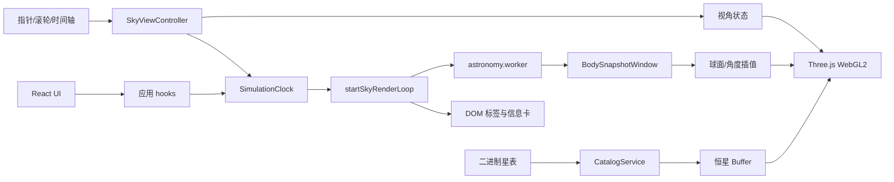

# Ad Astra 技术文档

## 1. 文档信息

- 文档类型：开发技术方案
- 文档版本：V1.0
- 编写日期：2026-08-19
- 上游文档：`docs/product-design.md`
- 天文原理：`docs/astronomy.md`（坐标、时间尺度、天体位置与运转规律；本文不重复推导）
- 数据发布：`docs/data-release-gate.md`
- 目标平台：桌面端 Web
- 部署形态：静态 PWA，首次完成资源缓存后可离线运行
- 浏览器范围：Chrome、Edge、Safari、Firefox 近两个主版本
- 运行下限：ES2022、WebGL2、ES Module Worker、Service Worker 与安全上下文（HTTPS 或 localhost）
- 授权目标：优先公共领域、CC0、MIT、BSD 等可商用来源

本文描述项目在开发层面如何落地：技术栈、分层、数据源、运行时协议、异常处理、测试与发布。天体「为什么在那里」见天文知识文档。

## 2. 结论摘要

采用自研轻量星空引擎，不引入运行时后端：

- 界面：React 19 + TypeScript + Vite 8（`src/app`、`src/features`）。
- 渲染：Three.js `WebGLRenderer` + 主线程 WebGL2（`src/engine/render`）。不支持 WebGL2 时展示明确错误，不进入 OffscreenCanvas 或 Canvas2D 星空渲染。
- 天文计算：`astronomy-engine`，放入独立 ES Module Worker。
- 恒星渲染：批次 GPU 点精灵，自定义 ShaderMaterial。
- 时间动画：统一模拟时钟 + Worker 精确采样 + 主线程插值。
- 数据分发：构建期裁剪、规范化和二进制打包；运行时不依赖远程天文 API。
- 离线能力：生产构建注册 Service Worker，缓存应用壳和星表。
- 星表策略：当前仓库使用自有开发夹具；生产候选为 NASA/USNO 目录，商业发布前书面授权核验门禁。

不直接采用 Stellarium Web Engine（AGPL/商业双授权、数据依赖和体量超出 MVP）。不采用 Canvas2D 作为主渲染路径。WebGPU 不作为 MVP 必需能力。

## 3. 技术约束与假设

### 3.1 已确认约束

- 不依赖运行时后端服务。
- 核心功能在断网状态下可用。
- 数据与依赖必须具备清晰的商业使用依据。
- WebGL2 是所有目标浏览器的共同生产能力。
- 不提供 `modulePreload` polyfill，也不提供 WebGL1/Canvas2D 星空回退。
- 精度为科普级，不用于专业观测和导航。

### 3.2 当前实现假设

- 默认视星等上限 `+5.5`。设计目标另有 `+5.5` 至 `+8.0` 扩展星表后台加载；当前生产包尚未接入。
- MVP 海拔缺省 0 米；`Observer` 只含纬度、经度。
- 大气折射使用 Astronomy Engine 的标准模型，不接入实时天气。
- 不显示卫星、彗星、小行星和深空天体目录。
- 时间范围按产品设计覆盖当前年份前后至少 200 年；界面时间轴默认展示约 8 小时窗口。

## 4. 方案比较与决策

### 4.1 采用：自研 Three.js 星空引擎

组成：React 负责界面和业务状态；Three.js 负责相机、WebGL2 管线和批量绘制；自定义 GLSL 负责恒星大小、颜色和可见性；Astronomy Engine 负责太阳系天体；Web Worker 负责星历采样。

原因：MIT 许可；能控制数据体积、帧预算和降级策略；恒星可压缩为少量 GPU Buffer；容易实现项目特有的时间轴、图层和视星等筛选。

代价：自建星表流水线；自行完成标签、拾取和辅助线；需要天文正确性回归测试。

### 4.2 不采用：Stellarium Web Engine

AGPL 与商业双授权不符合宽松可商用优先目标；默认数据体量和运行时服务超出静态离线 MVP；项目只需要其能力子集。仅作为交互和天文显示参考。

### 4.3 不采用：Canvas2D / D3-Celestial

Canvas2D 在大量星点、图层和连续时间更新下更依赖 CPU；D3-Celestial 数据包含多来源星表，不能只依据代码许可证判断商业授权。可用于离线验证投影，不作为生产主路径。

### 4.4 WebGL2 与 WebGPU

MVP 使用 Three.js `WebGLRenderer`。当前场景是少量绘制批次加大量点顶点，不需要 WebGPU 计算着色器。Firefox 对 WebGPU 的生产默认支持仍不适合作为统一基线。后续若迁移，渲染抽象层不得泄漏 WebGL 专属对象到业务层。

## 5. 总体架构

当前仓库是纯前端静态应用：无路由、无全局 store 库、无渲染 Worker。星空始终在主线程 WebGL2 提交。



热路径通过 `simulationRef` 共享同一可变 `SkySimulation`，避免同一帧内时间、地点、图层不一致。高频视角和时间不写入 React state。

## 6. 代码分层

逻辑分层与目录一一对应：一个顶层目录（以及 `engine/` 下的一个子目录）只承担一类职责。不再另设「领域层 / 数据层 / 离线层」去横切这些文件夹。

组织方式是 **feature-first UI + capability-first engine**：界面按功能切到 `features/`，引擎按能力切到 `engine/` 子目录。

### 6.1 顶层目录

| 目录 | 职责 |
| --- | --- |
| `src/app` | 应用壳：页面装配、低频 React 状态（地点、图层、视星等、视角）、加载与错误入口 |
| `src/features` | 功能 UI：每个子目录一个界面功能，只渲染和转发事件 |
| `src/engine` | 星空引擎，按能力再分子目录，见 6.2 |
| `src/workers` | 计算线程入口。目前只有 `astronomy.worker.ts` |
| `src/data` | 随源码维护的静态数据（星座连线 YAML、城市列表） |
| `src/config` | 产品常量（默认图层、方位、播放倍率、时间轴窗口） |
| `src/shared` | 跨目录共用的类型、错误、无业务 UI 零件 |
| `src/styles` | 全局样式 |
| `src/main.tsx` | 启动：挂载 React、生产环境注册 Service Worker |
| `public/data` | 构建生成的运行时星表，不是源码层 |
| `scripts/` | 星表构建、黄金样例、PWA 模板，不参与运行时分层 |

`src/app/hooks` 属于应用壳，不是单独一层。例如 `usePlayback` 把 `engine/clock` 接到 React 和时间控件上，时钟规则仍在 `engine/clock`。

### 6.2 引擎子目录

`src/engine` 不是「一层」，而是引擎包。子目录才是引擎内部的层，互不混放：

| 目录 | 职责 |
| --- | --- |
| `engine/clock` | 模拟时钟：UTC 推进、播放倍率，不碰 UI、不碰星历 |
| `engine/astronomy` | 太阳系快照、Worker 协议、采样窗口插值、星座锚点装配 |
| `engine/coordinates` | 坐标与地方时；天文常数（黄赤交角、儒略日、曙暮光阈值）在 `astroConstants.ts` |
| `engine/catalog` | 运行时加载并校验二进制星表 |
| `engine/render` | Three.js 场景、图层、材质、帧循环 |
| `engine/interaction` | 指针/滚轮、视角约束、拾取、DOM overlay 投影 |
| `engine/performance` | 帧统计、DPR、rAF 降频 |

星座连线的**源数据**在 `src/data`，**加载星表**在 `engine/catalog`，**把连线解析成几何**在 `engine/astronomy/constellationData.ts`。三者目录不同，不要再归成一个「数据层」。

### 6.3 依赖方向

```text
src/app、src/features
    → src/engine/*（按需引用子目录）
    → src/shared、src/config、src/data

src/workers/astronomy.worker.ts
    → src/engine/astronomy

src/engine/render、src/engine/interaction
    → src/engine/coordinates、src/engine/astronomy（读快照/方向）
    → src/engine/catalog（读运行时星表类型与顶点）

src/engine/astronomy、src/engine/clock、src/engine/catalog
    ↛ src/engine/render、src/engine/interaction、src/app
```

规则：

- `shared`、`config`、`data` 不反向依赖 `engine` 或 `app`。
- 只有 `engine/astronomy` 和 Worker 可以 `import 'astronomy-engine'`。`app`、`features`、`engine/render` 不得直接调用第三方天文 API。
- `engine/render` 不推进时间、不发起除注入回调以外的星历请求。
- PWA 缓存是构建产物（`scripts/pwa`）加启动注册（`main.tsx`），不是 `src/` 里的一层。

已知耦合（有意留在现目录，不另拆层）：

- `engine/coordinates/skyGeometry.ts` 使用 `three` 的 `Vector3`，供网格和大圆细分。
- `engine/render/startSkyRenderLoop.ts` 编排本帧：读 `SkySimulation`、插值天体、更新 overlay。装配发生在 `features/sky-viewer/SkyViewport.tsx`，不把渲染目录改成应用层。

### 6.4 `SimulationClock`（`engine/clock`）

职责：保存当前模拟 UTC 毫秒；管理播放方向和倍率；基于 `performance.now()` 推进，避免按帧累加造成掉帧时时间漂移。

禁止：直接修改 React 组件；执行星历计算。

播放公式：

```text
simulationUtc = pausedAt + (performance.now - startedAt) * rate
```

页面进入后台时停止 rAF，不补播后台时间。

### 6.5 `AstronomyService`（`engine/astronomy`）

唯一允许直接调用 `astronomy-engine` 的模块。输入 `Date` 与 `Observer`，输出太阳、月亮和行星的快照：赤经赤纬、方位高度、视星等、相位、土星光环倾角等。Worker 内复用同一服务。

同目录还有：Worker 协议与 `attachAstroWorker`、采样窗口插值、月相名称、星座锚点装配。

### 6.6 `CatalogService`（`engine/catalog`）

加载 `manifest.json`、二进制星表和名称索引；校验 HTTP 状态、字节长度、SHA-256 和记录数；解析为按视星等排序的运行时星表。失败抛出可重试的 `AppError('catalog')`。

### 6.7 `createSkyScene` / `startSkyRenderLoop`（`engine/render`）

创建和销毁 Three.js 资源；在同一 rAF 内更新地平矩阵、相机、uniforms、DOM overlay 并 `render`。

禁止：自行推进时间；直接 `import` 天文库；自行创建 Worker。太阳系采样通过 `SkyViewport` 注入的 `requestBodySnapshot` 触发。

### 6.8 `SkyViewController`（`engine/interaction`）

Pointer Events、滚轮、键盘；指针捕获和拖拽惯性；方位、高度、视场角约束；天体拾取。Three.js 相机只表达观察方向和视场，不承担天文坐标计算。

同目录的 `overlayProjection.ts` 把 NDC 转到 DOM 坐标，供帧循环写标签位置，仍属交互/投影，不放到 `render/layers`。

### 6.9 Worker（`src/workers`）

`astronomy.worker.ts` 只做天体快照，不做渲染。协议类型定义在 `engine/astronomy/astroWorkerProtocol.ts`，避免 Worker 文件成为第二套 API。

当前协议（实现）：

```ts
type AstroWorkerRequest = {
  type: 'snapshot'
  generation: number
  utcMillis: number
  lookAheadMillis: number
  observer: Observer
}
```

主线程为每个关键请求增加 `generation`；Worker 只回传最新 generation。过时响应丢弃。默认前瞻窗口 6 小时。最短请求间隔 120 ms；页面隐藏时不发请求。

运行时能力检测：主线程可创建 WebGL2 上下文；可创建 ES Module Worker；生产环境可注册 Service Worker。

## 7. 目录结构

与第 6 节同一张地图，注释表示该目录的唯一职责：

```text
src/
  main.tsx                 启动与 SW 注册
  app/                     应用壳
    App.tsx
    components/            TopBar、ControlPanel
    hooks/                 把 engine 接到 React（不是独立层）
  features/                功能 UI
    sky-viewer/            装配 scene / loop / worker / 指针
    location-controls/
    layer-controls/
    time-controls/
    object-details/
  engine/                  引擎包（子目录 = 能力）
    clock/                 模拟时钟
    astronomy/             天体快照与 Worker 协议
    coordinates/           坐标与地方时
    catalog/               运行时星表加载
    render/                WebGL 场景
      layers/
      materials/
    interaction/           视角、拾取、overlay 投影
    performance/           帧预算
  workers/                 计算线程入口
    astronomy.worker.ts
  data/                    源码内静态数据
  config/                  产品常量
  shared/                  类型、错误、通用 UI
  styles/
scripts/
  catalog/                 星表构建与授权门禁
  astronomy/               黄金样例校验
  pwa/                     Service Worker 模板
public/data/v1/            构建生成的运行时星表
tests/
docs/
data/licenses/
```

## 8. 核心数据模型

与 `src/shared/types` 对齐。地点时区属于城市配置，不属于核心 `Observer`。

```ts
type Observer = {
  latitude: number
  longitude: number
}

type SkyView = {
  azimuth: number
  altitude: number
  fov: number
}

type SkySimulation = {
  utcMillis: number
  observer: Observer
  magnitudeLimit: number
  layers: LayerState
  azimuth: number
  altitude: number
  fov: number
  scrubbing?: boolean
  wake?: () => void
}
```

图层开关包括恒星、星座连线（名称随连线显隐）、太阳系天体、地平线、地表与云层、地平线下对象、黄道、天赤道、赤道网、地平网、银河、昼夜效果。方位标记始终绘制。

## 9. 数据源方案

### 9.1 原则

数据进入产品前必须同时满足：来源可追溯；版本固定；许可证可归档；商业使用和再分发范围明确；转换过程可复现；生成物带来源和校验和；不因聚合站许可证忽略原始权利。

### 9.2 商业发布门禁

星表是当前最大非技术风险。`pnpm catalog:production` 读取 `data/licenses/catalog-sources.json`；`productionAllowed` 为 `false` 时构建失败。细则见 `docs/data-release-gate.md`。

门禁是发布阻断项。未获书面结论不得把候选星表打入生产包。若数据源包含 ESA Gaia、Hipparcos 或 Tycho，必须获得 ESA 商业授权或替换相关记录。

### 9.3 当前运行时数据

| 数据 | 现状 |
| --- | --- |
| 太阳、月亮、行星 | Astronomy Engine，MIT，Worker 内实时计算 |
| 恒星 | 仓库默认 `fixture-bright-stars`，约 226 颗亮星，位于 `public/data/v1/` |
| 星座连线 | 项目维护的 YAML，构建期生成，不复制未授权第三方连线 |
| 城市与时区 | 内置上海、北京、伦敦、纽约、悉尼；IANA 标识 + `Intl` |

开发夹具用于开发、CI 和 `pnpm build`，不是完整生产星表。

夹具（fixture）就是这份手写小样本：`pnpm dev` / `pnpm build` 打包的都是它，所以画面只有约两百颗星。渲染按 GPU 点批次设计，能力对得上核心 `+5.5`、扩展 `+8.0`，对不上银河系全部恒星。书面授权只打开「可否发布候选目录」的门；`catalog:production` 现在仍读 `stars.yaml`，BSC5P/SAO 的下载与转换适配器尚未接入。详见 `docs/data-release-gate.md`。

### 9.4 恒星目录候选（生产）

| 候选 | 用途 | 授权要点 |
| --- | --- | --- |
| Gaia DR3 | 内部精度验证 | ESA `CC BY-NC 3.0 IGO`，商业需申请 |
| Hipparcos / Tycho | 亮星与 HIP 编号生态 | 同样 NC，未授权不得分发 |
| HYG v4 | 开发原型 | `CC BY-SA 4.0`，上游仍含 Hipparcos 等 |
| NASA HEASARC BSC5P | 核心亮星优先候选 | 需核验 Yale 原始条款 |
| SAO Star Catalog | 扩展星优先候选 | 美国政府工作标记，仍须归档具体分发文件 |
| NASA SKY2000 | 备选与管线基准 | 编译目录，须核验非 NASA 上游 |
| USNO UCAC4 | 交叉校验 | 体量过大，只允许脚本提取必要字段 |

优先验证 `BSC5P 核心亮星 + SAO 扩展星`，同时保留 SKY2000/UCAC4 适配器。运行时不绑定外部目录编号。内部稳定 ID：

```text
internalStarId = hash(sourceNamespace + ":" + sourceObjectId)
```

生产数据源确认后只替换构建期适配器。流水线：

```text
Raw Catalog → Source Adapter → License Filter → Field Normalizer
  → Quality Filter → Magnitude Sort → Binary Pack → Manifest + Checksums
```

### 9.5 星表分包与格式（设计目标）

```text
public/data/v1/
  manifest.json
  stars-core.bin
  stars-extended.bin      # 设计目标；当前夹具为单包核心星表
  star-names / index JSON
  constellations.bin
  cities.json
  licenses.json
```

`stars-core.bin`：视星等 `<= +5.5`，首屏加载，必须包含星座锚点星。`stars-extended.bin`：`+5.5 < m <= +8.0`，可交互后后台加载。

设计中的 SoA 二进制便于零拷贝 TypedArray 与 GPU 上传。当前夹具实现为 `float32-soa`：每条记录赤经时数、赤纬、视星等，名称在独立 JSON 索引中。星表按视星等从亮到暗排序，筛选用二分得到数量后改 `drawRange`。

禁止手工修改最终二进制；禁止构建时查询未固定版本的「最新」数据；禁止缺失许可证继续生产构建。

### 9.6 太阳系计算库

主方案 Astronomy Engine：MIT、可在浏览器 Worker 运行、官方目标精度约 1 角分（相对 NOVAS/JPL）。JPL DE440/DE442 完整文件过大，不进入运行时，只作离线回归基准。Swiss Ephemeris 为 AGPL/商业双授权，不采用。ERFA 作为精度门禁失败后的坐标变换备选，不替代完整星历。

### 9.7 地点和时区

当前内置少量城市。设计上可用 GeoNames `cities15000`（CC BY 4.0）生成有限列表，中文名单独维护。

任意经纬度不打包全球时区边界；手动经纬度默认使用浏览器时区，用户可显式选择 IANA。界面区分观测地点和显示时区。不自行维护夏令时规则。`parseDateTimeLocal` 对夏令时重复时刻取较早 UTC，对不存在的地方时返回 `null`，不静默平移。

历史或远期页面应标识民用时间规则为近似。

## 10. 天文计算的工程封装

公式与物理含义见 `docs/astronomy.md`。本节只说明工程切分。

### 10.1 权威时间

内部以 UTC 毫秒为模拟时钟权威值。UI 先按 IANA 时区解析地方时，转换为 UTC 后进入时钟；显示时再转回目标时区。动画推进用 `performance.now()`，避免系统时钟跳变。

坐标内核应可替换：首版由 Astronomy Engine 与项目内 `skyMath` 共同完成。恒星地平矩阵在主线程每帧计算；太阳系视位置在 Worker 中计算。

### 10.2 恒星

构建期给出 J2000 赤经赤纬。运行时转为赤道单位向量，乘以由地方恒星时和纬度构成的 3×3 地平矩阵，在顶点着色器中完成。时间变化时不重传恒星 Buffer，只更新矩阵 uniform。

设计目标另含顶点着色器自行传播；当前夹具星表未带自行向量。

### 10.3 太阳系采样与插值

Worker 返回时间窗口两端的 `BodySnapshot`。主线程对赤经赤纬做球面线性插值，对方位、高度、星等、相位做最短角/线性插值。拖动时间轴时恒星矩阵即时响应；行星使用最近窗口预测，并异步请求新采样。

月亮必须走站心 + 标准折射路径，与黄金样例一致。单个天体失败不应拖垮整帧；无有效窗口时保持上一结果。

### 10.4 辅助线

黄道按固定黄赤交角采样黄经 0°–360° 再转入赤道方向；天赤道为赤纬 0 的大圆。赤道网、地平网在构建时生成，显隐只改材质可见性。大圆用球面细分，避免长弦穿入天球。

### 10.5 精度验收（工程）

- 太阳、主要行星：与归档 JPL Horizons 对比不超过 3 角分。
- 月亮：不超过 5 角分。
- 亮星：±200 年不超过 5 角分。
- CI 禁止实时调用 JPL；基准必须入库。当前 `pnpm astro:golden` 对照 Astronomy Engine 钉死样例，角误差阈值 0.02°。

## 11. 渲染设计

### 11.1 场景约定

右手坐标：`+Y` 天顶，`+Z` 北，`+X` 西。方位角数值仍是北为零、向东增加；渲染把东放到 `-X`，这样面朝南时左东右西，与肉眼一致（Three.js 相机朝向 `-Z` 时屏幕右侧为 `+X`）。相机为 `PerspectiveCamera`，位于单位球心；用方位角和高度角生成观察方向，不允许 roll。视场建议 20°–100°。高度角在天顶附近需稳定处理。

### 11.2 图层顺序（后到前）

天空背景 → 地平遮罩 → 恒星 → 星座连线 → 黄道/天赤道/网格 → 太阳系天体 → 选中高亮 → DOM 标签与 UI。

恒星使用 `THREE.Points` + `ShaderMaterial`，禁止每颗星一个 Mesh。视星等筛选：CPU 二分 + `setDrawRange`，阈值附近可用 shader 淡入淡出；不重建几何、不重传整表。

太阳系天体用少量精灵/实例批次，屏幕尺寸按可辨认大小而非真实角直径。点击半径与视觉大小分离；太阳、月亮、行星优先于恒星。

### 11.3 标签与拾取

标签限于选中对象、太阳系天体、星座名、少量亮星和方位。流程：三维方向投影 → 剔除视锥外/地平下 → 避让 → `translate3d`。标签频率可低于 60 Hz，但必须使用本帧同一时间状态。

拾取不依赖每颗星的 Three 对象：点击转射线，球面分区取候选，按夹角和屏幕半径选最近高优先级对象。

### 11.4 昼夜背景

由太阳高度角连续插值白昼、民用/航海/天文曙暮光和夜间。恒星在白昼按高度和亮度抑制。「始终显示」类开关可绕过抑制，但应保留产品提示。

### 11.5 WebGL 上下文丢失

监听 `webglcontextlost`；暂停播放；保存业务状态；恢复后重建 Renderer、材质和 GPU Buffer；失败则提示刷新。

## 12. 时间与动画

### 12.1 交互状态

播放、暂停、时间轴拖动（scrub）、跳转后短时收敛。拖动只保留最新目标；松手后请求精确终点。切换倍率时应对 `rate` 做短缓变。暂停不吸附到采样点。

大跨度年/十年/百年跳转不按真实角速度播放全过程：计算目标状态，短时过渡后用准确终点覆盖插值。

### 12.2 优先级

指针/键盘输入 → 最新时间与地点 → 精确终点计算 → 自动播放 → 标签与装饰 → 后台预加载。低优先级不得阻塞输入。

## 13. 状态管理

持久业务状态：观测者、显示时区、播放模式、图层、视星等阈值、质量偏好。高频渲染状态（矩阵、四元数、插值方向、指针、帧统计）不进 React state。

当前用 React hooks + `simulationRef`，不用 Zustand。Local Storage 保存图层、视星等、地点和视角等偏好。精确定位默认不上传。

## 14. 性能

### 14.1 预算

- 页面框架 1 秒内可见；首个可交互星空 3 秒内。
- 压缩后：应用 JS 建议不超过 600 KB；核心星表与星座不超过 1.5 MB；首次可交互总资源不超过 2.5 MB。
- 60 FPS 帧预算约 16.7 ms；滚动窗口 P95 不超过 22.2 ms（45 FPS）；输入到反馈低于 100 ms。
- 常规 draw call 目标不超过约 12 次。
- JS Heap 稳态建议小于 100 MB；禁止在渲染循环中大量分配临时向量和闭包。

### 14.2 自适应质量

High / Balanced / Low：限制 DPR、标签频率、光晕和扩展星。连续 2 秒 P95 超时则降级；连续 5 秒稳定再升级一级，避免抖动。不可降级：模拟时间正确性、太阳系最终位置、主要亮星、选中对象、时间轴响应。

当前实现含基于帧时长的 pixel ratio 调度与空闲降频 rAF，完整三档状态机仍可按设计补齐。

### 14.3 缓存

HTTP 长缓存 + 内容哈希。Service Worker Cache Storage 缓存静态资源。新版本完整可用后原子切换；失败回退上一有效版本。禁止混用不同版本的星表、名称和星座连线。

## 15. 错误处理

错误统一为 `AppError`，带 `code` 与 `retryable`。UI 用 `ErrorPanel` / `ErrorBoundary` 展示，可重试的提供重试。

| code | 标题 | 典型原因 | 处理 |
| --- | --- | --- | --- |
| `catalog` | 星表无法加载 | 网络失败、非 200、长度/SHA-256/记录数不符、索引损坏 | 阻断星空，保留重试；`AbortError` 忽略 |
| `webgl` | 无法绘制星空 | 无 WebGL2、上下文创建失败 | 明确错误，不回退 Canvas2D |
| `worker` | 天体计算中断 | Worker `error` / 计算抛错 / 协议 `type: 'error'` | 丢弃过时 generation；可重试；恒星视图应仍可用 |
| `service-worker` | 离线缓存不可用 | 注册失败 | 打日志，继续在线模式，不阻断首屏 |
| `render` | 界面渲染失败 | React 渲染异常、根节点缺失 | ErrorBoundary 捕获，允许重试 |
| `unknown` | 出现未知错误 | 未分类异常 | 日志 + 通用提示 |

### 15.1 数据加载

核心星表失败：错误页 + 重试。扩展星表失败（设计）：核心星空继续，提示扩展不可用。校验和失败：删除损坏缓存并重新下载。新版本失败：回退上一完整版本。

### 15.2 Worker

捕获 `error` 与计算异常。主线程只接受当前 `generation`。设计目标：暂停播放、重建 Worker 一次；重建失败则保留恒星静态视图，禁用太阳系动画并提示。

### 15.3 天文结果校验

输入时间和坐标先做范围校验。结果检查有限数、单位向量长度和高度角范围。单个天体失败不影响其他天体。最后有效帧继续显示。

### 15.4 性能与离线

自动降级，不无限重试高质量。质量降级不改变核心位置计算。Service Worker 仅生产注册；开发模式主动注销，避免干扰热更新。

### 15.5 时间解析

非法 `datetime-local` 或夏令时空洞时刻：解析返回 `null`，不提交到模拟时钟。不把异常地方时静默改写为邻近时刻。

## 16. 测试方案

### 16.1 数据构建

源文件 SHA-256 与 lock 一致；生产源完成商业核验；恒星 ID 唯一；视星等单调排序；核心包含星座锚点；位置向量长度接近 1；输出写入 manifest；相同输入字节级一致。

### 16.2 天文正确性

固定地点（北京、伦敦、纽约、悉尼，以及赤道与极圈附近）、当前时间与 ±200 年边界、分至、月亮近地平、行星冲合、高自行星。对照归档 JPL、Astronomy Engine 官方测试、可选 ERFA/桌面软件抽样。验证方位高度、角距离、黄道与天赤道关系、地平上下、东西不镜像。

当前仓库：`pnpm astro:golden` + `tests/astronomyService.test.ts`、`tests/skyMath.test.ts`、`tests/dateTimeLocal.test.ts`。

### 16.3 时间动画与交互

多倍率正反向播放、拖拽缩放、快速时间轴、连续跳转只落地最后一个目标、后台恢复不补播、暂停不吸附。Pointer Capture、画布外松手、天顶旋转、视星等单调性、拾取优先级、输入框内快捷键不误触。

### 16.4 性能与浏览器

默认 `+5.5`、最大 `+8.0`、全辅助线、播放同时拖拽、30 分钟稳定性。采集 FPS、帧时长分位、Long Task、Heap、draw call、Worker 延迟、过时任务丢弃数。

浏览器至少覆盖四款稳定版及其上一主版本：WebGL2、Shader、Worker、Transferable、Service Worker、IndexedDB、IANA/DST、上下文恢复。

## 17. 构建与部署

```text
license check → catalog build → catalog verification
  → unit tests → type check → app build
  → bundle budget check → E2E smoke
```

常用命令：`pnpm dev` / `test` / `verify` / `build` / `build:release` / `gate:data` / `catalog:production`。

生产失败条件：授权未核验、校验和不匹配、首屏包超预算、天文基准超差、冒烟失败。

静态部署：任意对象存储或 CDN；数据文件内容哈希；Brotli/gzip；`.bin` MIME 为 `application/octet-stream`。PWA：应用壳离线可启动；核心星表缓存后支持默认星空；数据升级后台下载后原子切换。

Docker 为单 Nginx 容器，见 `docker/README.md`。

## 18. 可观测性与供应链

默认可关闭的匿名性能：首屏可交互时间、星表加载、帧 P95、长帧比例、Worker 采样延迟、过时响应数、质量等级变化、WebGL 上下文丢失、数据完整性失败。不记录精确经纬度、自定义时间和搜索内容。

依赖锁文件入库；CI 漏洞扫描；数据脚本只访问白名单来源；源文件与生成文件 SHA-256；禁止运行数据包内代码；JSON Schema 校验；星名纯文本渲染，不用 `innerHTML`；第三方许可证随发布包提供。

## 19. 架构决策记录

| 编号 | 决策 | 状态 |
| --- | --- | --- |
| ADR-001 | WebGL2 作为生产主渲染路径 | 接受 |
| ADR-002 | 不引入运行时后端 | 接受 |
| ADR-003 | Astronomy Engine 作为太阳系计算主库 | 接受 |
| ADR-004 | 星表使用构建期适配器，运行时格式与源目录解耦 | 接受 |
| ADR-005 | 主线程 WebGL2 渲染，计算放入 Worker（取代 OffscreenCanvas 优先） | 接受 |
| ADR-006 | 星表按视星等排序，筛选走二分 + drawRange | 接受 |

ADR-005 原因：热路径需要同一帧更新 horizon 矩阵、相机、overlay DOM 和 `renderer.render`；天体计算已在独立 Worker 中隔离。

## 20. 当前实现与设计目标

下列差异避免把设计文档误当成已交付能力：

| 项目 | 当前实现 | 设计目标 |
| --- | --- | --- |
| 星表 | 自有夹具约 226 星；`catalog:production` 仍读 YAML，仅多授权检查 | BSC5P + SAO 适配器接入后的核心/扩展包，至 +8.0 |
| Worker 协议 | 单一 `snapshot` + 6 小时窗口 | 更细的 INIT / SAMPLE_RANGE / SAMPLE_AT |
| 状态库 | React hooks + ref | 可选 Zustand，仍禁止每帧重渲染 |
| 恒星自行 | 夹具未带自行列 | 顶点着色器 `p0 + dp/dt * Δt` |
| 扩展星表 | 未分包后台加载 | 首屏后加载，完整离线提示 |
| 质量状态机 | 帧统计与 DPR 调度 | High/Balanced/Low 完整升降级 |
| 城市数据 | 5 个内置城市 | GeoNames 裁剪列表 |
| 渲染 Worker | 无 | 明确不作为当前方案 |

## 21. 主要风险与应对

- **星表授权不明确**：阻断商业发布。源级许可证追踪；适配器与运行时解耦；生产构建强制检查。
- **+8.0 体积过大**：核心/扩展分包、二进制 SoA、Brotli、扩展包后台加载。
- **时间轴拖动时星历追不上**：generation 取消、每帧合并输入、恒星矩阵即时响应、行星采样与插值解耦。
- **标签与星点不同步**：单一 `SkySimulation`；标签不得使用旧时间。
- **Safari/Firefox 性能**：WebGL2 基线、DPR 与质量降级、不依赖 WebGPU。
- **百年跨度恒星误差**：保留自行、高自行样例、明确科普级边界。
- **时区与夏令时**：内部用 UTC；IANA；重复/空洞地方时显式处理；任意经纬度不猜测时区边界。

## 22. 参考资料

### 数据与许可证

- ESA Gaia：<https://www.cosmos.esa.int/web/gaia-users/license>
- ESA Hipparcos/Tycho：<https://www.cosmos.esa.int/web/hipparcos/catalogues>
- HYG：<https://codeberg.org/astronexus/hyg>
- NASA BSC5P：<https://heasarc.gsfc.nasa.gov/W3Browse/catalog/bsc5p.html>
- NASA SAO：<https://heasarc.gsfc.nasa.gov/W3Browse/all/sao.html>
- NASA SKY2000：<http://tdc-www.harvard.edu/catalogs/sky2k.html>
- UCAC4：<https://irsa.ipac.caltech.edu/data/USNO/UCAC4/ucac4.html>
- GeoNames：<https://download.geonames.org/export/dump/readme.txt>
- IANA tzdb：<https://www.iana.org/time-zones>

### 工程与渲染

- Astronomy Engine：<https://github.com/cosinekitty/astronomy>
- Three.js：<https://threejs.org/>
- Stellarium Web Engine（参考，不采用）：<https://github.com/Stellarium/stellarium-web-engine>
