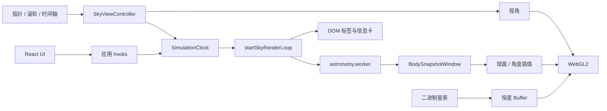

# Ad Astra 技术说明

本文说明软件如何把「地点 + 时间」画成可交互的星空。天体为什么在那个方向，见 [天文原理](astronomy.md)。交互与界面规则见 [产品设计](product-design.md)。

## 1. 结论

Ad Astra 是纯前端静态 PWA，运行时没有后端、没有远程星历 API。

| 问题 | 做法 |
| --- | --- |
| 界面 | React 19。只持有地点、图层、选中对象等低频状态 |
| 星空 | 主线程 Three.js `WebGLRenderer`（WebGL2）。不支持 WebGL2 则明确报错，不回退 Canvas2D |
| 恒星 | 构建期二进制星表 → GPU 点精灵。时间变了只改矩阵 uniform |
| 太阳系 | `astronomy-engine` 放在 ES Module Worker；主线程在采样窗口两端插值 |
| 时间 | 内部只认 UTC 毫秒。播放按墙钟倍率推进，不按帧累加 |
| 离线 | 生产构建注册 Service Worker，缓存应用壳和星表 |

不引入 Stellarium Web Engine（授权与体量不适合这套静态应用）。不把 WebGPU 当作运行基线。精度按科普级：画面与肉眼所见大致相符，不用于望远镜指向或导航。

## 2. 从输入到画面

每一帧要回答的是：在这个地点、这个瞬间，各个方向上有什么。

```text
民用地方时 + IANA 时区
        → UTC 毫秒（唯一模拟时间）
              ├─ 恒星：J2000 赤道方向 ×（地平矩阵 × IAU 1976 岁差）→ 当地天空
              └─ 太阳/月亮/行星：Worker 星历 → 视赤经赤纬与地平坐标 → 球面插值
                        → 球面投影到屏幕 → WebGL 图层 + DOM 标签
```

恒星和太阳系走两条路径，再汇合到同一套地平坐标和同一套投影。恒星几乎钉在天球上，所有星共用一个随时间和地点变化的 3×3 矩阵；太阳系天体每个瞬间位置都不同，所以单独采样。

热路径共享一份可变的 `SkySimulation`（存在 `simulationRef` 里）：UTC、观测者、视星等上限、图层、视角。同一帧内，矩阵、天体、标签、信息卡读的是同一份状态。

## 3. 运行时结构



没有路由，没有全局 store。星空始终在主线程提交绘制；Worker 只做太阳系快照，不做渲染。

## 4. 代码分层

界面按功能切到 `features/`，引擎按能力切到 `engine/` 子目录。一个目录只承担一类职责。

| 目录 | 职责 |
| --- | --- |
| `src/app` | 应用壳：装配页面、低频 React 状态、加载与错误 |
| `src/features` | 功能 UI。只渲染和转发事件 |
| `src/engine/clock` | 模拟时钟：UTC 推进与播放倍率 |
| `src/engine/astronomy` | 太阳系快照、Worker 协议、插值、星座锚点、月相名 |
| `src/engine/coordinates` | 赤道↔地平、岁差、儒略日、曙暮光阈值、地方时解析 |
| `src/engine/catalog` | 加载并校验二进制星表 |
| `src/engine/render` | Three.js 场景、图层、材质、帧循环、昼夜 |
| `src/engine/interaction` | 指针、视角约束、拾取、DOM overlay 投影 |
| `src/engine/performance` | 帧统计、DPR、空闲降频 |
| `src/workers` | `astronomy.worker.ts`：计算线程入口 |
| `src/data` | 源码内静态数据：星座 YAML、城市、源星表 |
| `src/config` | 默认图层、方位、播放倍率、时间轴窗口、快捷视角 |
| `src/shared` | 跨目录类型、错误、无业务 UI |

依赖方向：

```text
app / features
    → engine/*（按需）
    → shared / config / data

workers/astronomy.worker.ts → engine/astronomy

engine/render、engine/interaction
    → engine/coordinates、engine/astronomy（读方向 / 快照）
    → engine/catalog（读星表）

engine/astronomy、clock、catalog
    ↛ render、interaction、app
```

规则：

- 只有 `engine/astronomy` 和 Worker 可以 `import 'astronomy-engine'`。界面和渲染层不直接调第三方星历。
- `engine/render` 不推进时间、不创建 Worker。太阳系采样由 `SkyViewport` 注入的回调触发。
- `shared`、`config`、`data` 不反向依赖 `engine` 或 `app`。

有意保留的耦合：`skyGeometry.ts` 用 Three.js 的 `Vector3` 做网格细分；`startSkyRenderLoop.ts` 编排一帧（矩阵、插值、overlay、`render`），装配发生在 `SkyViewport.tsx`。

## 5. 时间

### 5.1 权威值

内部只认 **UTC 毫秒**。用户看到的日期时间是某个 IANA 时区下的民用地方时：

1. 界面用 `datetime-local` 输入地方时；
2. `parseDateTimeLocal` 按该时区换成 UTC，写入时钟；
3. 显示时再格式化回同一时区。

观测地点和显示时区是两件事。地点决定抬头看到哪片天；时区只决定钟面上写几点。手动经纬度沿用所选城市的时区（也就是浏览器 `Intl` 认识的 IANA 标识），不在客户端维护全球时区边界多边形。

夏令时：钟面重复的那一分钟取较早的 UTC；春令时拨快造成的空洞时刻返回 `null`，不悄悄改成邻近分钟。

### 5.2 模拟时钟

`SimulationClock` 用墙钟倍率推进，避免按帧累加在掉帧时让时间跑偏：

```text
simulationUtc = pausedAt + (performance.now - startedAt) * rate
```

播放倍率（`src/config/playbackSpeeds.ts`）：实时、1 分钟/秒、5 分钟/秒（默认）、1 小时/秒、1 天/秒。底部时间轴窗口约 8 小时，步进 1 小时。标签页进入后台时停 rAF，恢复后不补播后台经过的时间。

拖动时间轴时设 `simulation.scrubbing`，暂停向 Worker 刷精确采样，松手后再请求终点窗口。过时的中间目标直接丢弃，只保留最新时间。

## 6. 恒星与星表

### 6.1 运行时数据

| 数据 | 来源 | 运行时形态 |
| --- | --- | --- |
| 亮星 | `src/data/stars.yaml`，构建期打包 | `public/data/v1/core-stars.bin` + 名称索引 JSON |
| 星座连线 | 项目维护的 YAML | 运行时用恒星 id 解析成几何；名称锚点取所用恒星方向的平均 |
| 城市 | `src/data/cities.ts` | 上海、北京、伦敦、纽约、悉尼 + IANA 时区 |
| 太阳、月亮、行星 | Astronomy Engine | Worker 内按时刻计算，不进星表 |

星表约 226 颗，按视星等从亮到暗排序，覆盖星座连线所需锚点。这是一份为辨认星座准备的亮星目录，不是全天巡天星表。太阳系天体不走这套筛选。

每条恒星记录：J2000 赤经（时）、赤纬（度）、视星等。名称、星座、颜色在独立索引里。二进制是 `float32-soa`：构建脚本写入校验和与记录数，`CatalogService` 校验 HTTP 状态、字节长度、SHA-256 和条数后再解析。失败抛出可重试的 `AppError('catalog')`。

视星等筛选：CPU 二分得到「不暗于上限」的数量，再 `setDrawRange`。不重建几何、不重传整表。默认上限 `+5.5`。

### 6.2 恒星如何转到当地天空

星表坐标是 J2000 赤道。加载时把每颗星写成天球单位向量，上传一次 GPU Buffer。之后每帧：

1. 由 UTC 和经度算地方恒星时，再和纬度一起写出 **地平矩阵**（赤道 → 西 / 天顶 / 北）；
2. 用 IAU 1976 / Meeus 公式写出 **岁差矩阵**（J2000 赤道 → 日期平赤道，不含章动）；
3. 两者相乘得到 `eqjHorizonMat`，作为恒星、星座、黄道、天赤道、银河的 uniform。

顶点着色器里：`地平方向 = eqjHorizonMat × J2000 方向`。时间变了只更新 9 个 float，星星本身不用动。行星不用这套岁差：Astronomy Engine 给出的已经是该日期的视赤道坐标，只乘地平矩阵。

## 7. 太阳系计算

`AstronomyService` 是唯一调用 `astronomy-engine` 的模块。输入 `Date` 和 `Observer`（纬度、经度，海拔按 0），输出太阳、月亮和水星到海王星的快照：方位、高度、赤经赤纬、视星等、相位；月亮带朔望角，土星带光环倾角。月亮走站心 + 标准大气折射，与黄金样例同一条路径。

Worker 协议只有一种请求：

```ts
type AstroWorkerRequest = {
  type: 'snapshot'
  generation: number
  utcMillis: number
  lookAheadMillis: number
  observer: Observer
}
```

主线程为每次关键请求加 `generation`；Worker 只回最新代。过时响应丢弃。默认前瞻窗口 6 小时，最短请求间隔 120 ms，页面隐藏时不发请求。

主线程在窗口两端之间：

- 赤经赤纬：球面线性插值（把赤道方向当成单位向量）；
- 方位、高度、星等、相位：最短角 / 线性插值。

拖时间轴时恒星矩阵立刻跟上；行星用当前窗口预测，并异步要新窗口。某个天体失败不影响整帧；没有有效窗口时沿用上一帧结果。

黄金样例（`pnpm astro:golden`）钉死 Astronomy Engine 在固定地点时刻的太阳、月亮、木星方位高度，角误差阈值 0.02°。产品精度立场见天文文档：太阳/行星约 3 角分、月亮约 5 角分，相对实验室星历而言。

## 8. 坐标与投影

### 8.1 地平右手系

```text
+Y 天顶
+Z 北
+X 西
```

方位角仍是北为零、向东增加。把东放到 `-X`，是因为 Three.js 相机朝向 `-Z` 时屏幕右侧为 `+X`：面朝南时左东右西，与抬头看天一致。若把东放到 `+X`，东西会左右镜像。

相机是球心处的 `PerspectiveCamera`，用方位角和高度角生成观察方向，没有 roll。仰角限制约 −30°～89°，避免翻转到难以理解的姿态。默认面朝南、平视地平。

### 8.2 天空投影

真正画到屏幕上时，不用透视盒子去「看」一个场景，而是把朝前的那一半天球摊成圆盘（立体投影思路）：

- 地平略向下抬（`SKY_HORIZON_LIFT`），平视时多露出天空、少露出地下；
- 转到天球背面的方向被裁掉，画面外是虚空色，看起来是「球」而不是矩形视锥；
- 视场约 38°～128°，默认 100°。

同一套投影函数同时用于 GLSL 顶点和 DOM 标签 / 拾取，避免星点和标签各算各的。

## 9. 渲染

### 9.1 图层（后到前）

天空穹顶 → 银河 → 恒星 → 星座连线 / 赤道网 / 地平网 → 太阳系天体 → 地面与地平圈 / 黄道 / 天赤道 → 近地平光晕 → DOM 标签与 UI。

恒星是一批 `THREE.Points`，禁止每颗星一个 Mesh。太阳系天体是少量精灵，屏幕尺寸按可辨认大小，不是真实角直径；太阳、月亮始终比行星大，行星再按视星等略缩放。点击半径与视觉大小分开：太阳按光球拾取，光晕不扩大命中区。

黄道按固定黄赤交角（J2000 约 23.439°）采样黄经 0°–360°，再转入赤道方向；黄北极 / 黄南极为同一交角下的 J2000 方向，用屏幕十字标签，随黄道图层显隐。天赤道是赤纬 0 的大圆。网格在创建时生成，显隐只改材质可见性。大圆沿球面细分，避免长弦穿进天球。

银河是银道坐标系下的程序带（IAU 北银极与银心），加性混合，白天被压暗。不是全天摄影纹理。

### 9.2 昼夜

由太阳高度角连续算出 `daylight / twilight / warmth`，喂给天空穹顶、地面、恒星消光和 UI 主题：

| 太阳高度 | 阶段 |
| --- | --- |
| ≥ 0° | 白昼 |
| 0°～−6° | 民用曙暮光 |
| −6°～−12° | 航海曙暮光 |
| −12°～−18° | 天文曙暮光 |
| < −18° | 夜晚 |

「昼夜影响」关闭时，天空按夜晚画，但太阳方向仍用于定位日盘。恒星在白昼按高度和亮度衰减；「显示地平以下」用半透明画出地下天体，不把它们折射到地平之上。

### 9.3 标签

方位字、星座名、黄道极、悬停名、选中信息卡，每帧把三维方向投影到 DOM，用 `translate3d` 钉住。地平附近的字有最低高度，避免埋进地面。标签和星点使用同一帧的时间和矩阵。

### 9.4 拾取

不给每颗星建 Three 对象。点击先转成屏幕 NDC 射线：太阳系天体按屏幕半径命中，优先级高于恒星；恒星走网格粗筛再线性精修。命中后写出方位、高度、视星等；月亮附带月相名称和照明比例。

## 10. 交互

`SkyViewController` 处理 Pointer Events、滚轮和键盘：指针捕获、拖拽惯性、方位 / 仰角 / 视场约束。Three.js 相机只表达「朝哪看、看多宽」，不承担天文坐标计算。

快捷视角：东 / 南 / 西 / 北（仰角 0°）和天顶（仰角 82°，方位不变）。键盘：方向键旋转，`+` / `-` 缩放。输入框聚焦时不抢快捷键。

默认图层（`src/config/defaultLayers.ts`）：恒星、星座、行星、地平、地面、黄道、天赤道、银河、昼夜效果开启；赤道网、地平网、地平以下关闭。

## 11. 性能

原则：输入优先于装饰；时间连续性和最终位置正确性不可降级。

- 高频视角和时间不进 React state。时钟文字通过 DOM ref 直接改，避免整树刷新。
- 交互中满帧 rAF；静止约 250 ms 一帧（约 4 fps）。拖拽或时间变化后保持约 450 ms 满帧。
- 根据帧时长调节 `devicePixelRatio` 上限，优先保流畅。
- 渲染循环避免每帧分配临时向量和闭包；插值结果写入预分配槽位。
- 页面隐藏停止调度。WebGL 上下文丢失时暂停，由浏览器恢复后重建。

## 12. 错误

统一为 `AppError`，带 `code` 和 `retryable`。UI 用 `ErrorPanel` / `ErrorBoundary` 展示。

| code | 含义 | 处理 |
| --- | --- | --- |
| `catalog` | 星表网络失败、长度 / SHA-256 / 条数不符 | 阻断星空，可重试；`AbortError` 忽略 |
| `webgl` | 无 WebGL2 或上下文创建失败 | 明确错误，不回退 Canvas2D |
| `worker` | Worker 抛错或协议 `error` | 丢弃过时 generation；恒星视图仍可画 |
| `service-worker` | 注册失败 | 打日志，继续在线模式 |
| `render` | React 渲染异常 | ErrorBoundary，可重试 |
| `unknown` | 未分类 | 通用提示 |

Service Worker 仅生产注册；开发模式主动注销。星表校验失败时不混用不同版本的二进制和索引。

## 13. 测试与验证

```bash
pnpm typecheck
pnpm lint
pnpm test
pnpm astro:golden
pnpm verify          # 以上全部
```

覆盖的结论性检查包括：地平 / 岁差矩阵、地方时与夏令时、模拟时钟、采样节流、插值与昼夜、投影与拾取、星表校验、图层顺序、资源释放。黄金样例对照入库的 Astronomy Engine 数值，CI 不访问 JPL。

## 14. 构建与部署

```text
生成星表 → 打包静态资源 →（生产）注册 Service Worker
```

- `pnpm dev`：开发服务，热更新，无 SW。
- `pnpm build`：生成星表并输出 `dist/`。
- `pnpm preview`：本地预览生产包。

静态部署要求 HTTPS（或 localhost）、`.bin` 以 `application/octet-stream` 提供。带内容哈希的资源可长期缓存；`index.html` 与 `service-worker.js` 必须短缓存，否则用户会卡在旧壳上。Docker 为单 Nginx 容器，见仓库 `docker/README.md`。

扩大星表（更多暗星）是数据授权问题，不是渲染上限：GPU 路径按批次点精灵和 `drawRange` 设计。来源核验步骤见 [数据发布门禁](data-release-gate.md)。

## 15. 架构决策

| 编号 | 结论 |
| --- | --- |
| ADR-001 | 生产渲染路径是 WebGL2 |
| ADR-002 | 不引入运行时后端 |
| ADR-003 | 太阳系计算用 Astronomy Engine |
| ADR-004 | 星表在构建期规范化，运行时格式与源目录解耦 |
| ADR-005 | 主线程画、Worker 算。同一帧要更新矩阵、相机、DOM overlay 和 `render`，不把绘制拆到 OffscreenCanvas |
| ADR-006 | 星表按视星等排序，筛选走二分 + `drawRange` |

## 16. 参考

- Astronomy Engine：<https://github.com/cosinekitty/astronomy>
- Three.js：<https://threejs.org/>
- IANA 时区：<https://www.iana.org/time-zones>
- Meeus, *Astronomical Algorithms*（儒略日、恒星时、岁差）
